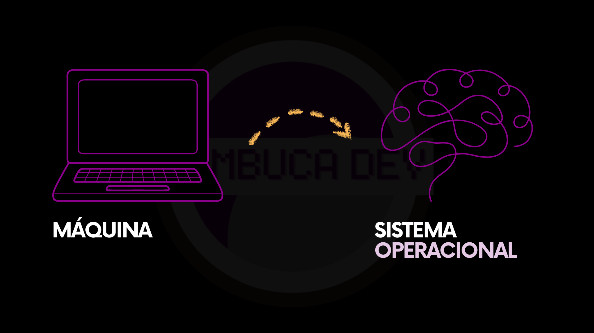
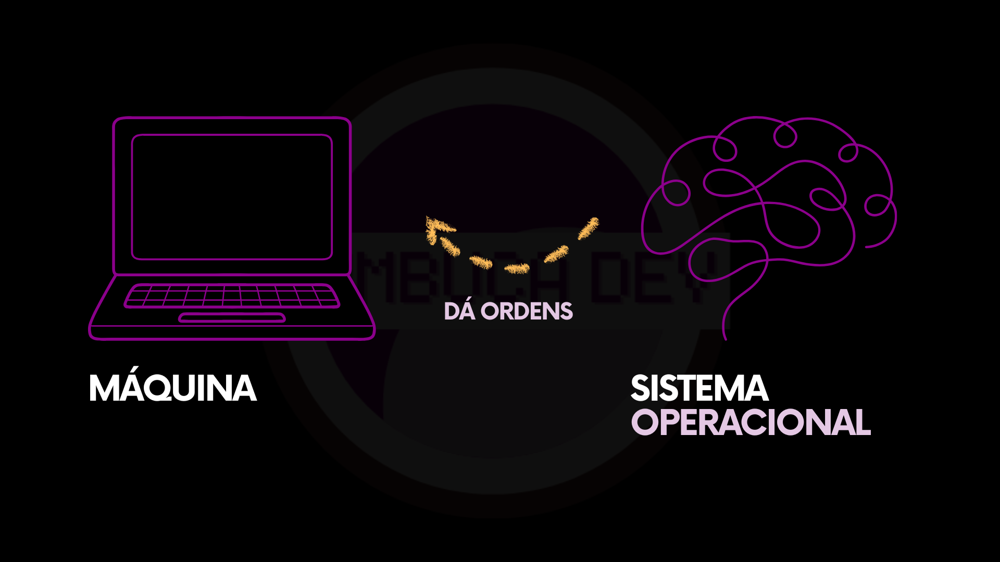

# 1.1 O cérebro do computado: Sistema Operacional

Antes de falar de Git, GitHub ou qualquer outro conceito que vamos usar ao longo deste livro, precisamos entender duas pontos fundamentais: **como um computador funciona** e **como vamos nos comunicar com ele**.

Quando usamos um computador, **não conversamos diretamente com a máquina**. Entre você e o computador existe uma camada fundamental, responsável por entender o que você pede, organizar tudo internamente e garantir que as instruções sejam executadas de forma ordenada. Essa camada se chama **sistema operacional**.

Uma boa forma de imaginar isso é pensar no computador como um corpo. O máquina — teclado, tela, memória, disco, processador — é a parte física. O sistema operacional é o cérebro. É ele que recebe as instruções, decide o que fazer com elas e coordena todas as ações necessárias para que uma tarefa seja executada de verdade.

<figure><figcaption></figcaption></figure>

<figure><figcaption></figcaption></figure>

Sem um sistema operacional, o computador até existe fisicamente, mas não sabe como se comportar. Ele não entende pedidos, não organiza arquivos, não executa programas. Tudo o que fazemos passa, obrigatoriamente, por esse “cérebro”.

De maneira simples, um sistema operacional é o software mais importante do computador. É ele que permite que você use a máquina e que gerencia todos os outros programas. Sempre que você abre um programa, cria ou move um arquivo, conecta um dispositivo ou executa alguma ação, é o sistema operacional que está trabalhando nos bastidores. Ele gerencia memória, controla o que está rodando ao mesmo tempo, organiza pastas, define permissões e evita que um programa atrapalhe o outro.

Você não precisa entender todos esses detalhes agora. Para este livro, basta guardar algumas ideias simples: **o que é um sistema operacional**, **qual é a sua função básica** e **que existem tipos diferentes de sistema operacional**. Dependendo de qual você usa, a forma de interação muda um pouco.

Essas diferenças existem, mas não são um obstáculo. Elas apenas significam que alguns comandos, nomes ou comportamentos podem variar levemente entre um sistema e outro. Portante, precisamos dar um pequeno passo prático neste momento antes de seguir adiante: identificar qual é o sistema operacional que está rodando no seu computador.

Lembrando que, o papel do sistema operacional, no entanto, é sempre o mesmo: ser o intermediário entre a pessoa usuária e a máquina.
