# 14.6.2.3 Lidando com o Feedback

Na seção anterior, solicitamos a revisão do PR para a conta da **camilamaia**. Agora, vamos entender como lidar com o feedback recebido e aplicar as sugestões na prática.

A revisão da conta **camilamaia** foi concluída. Podemos verificar isso tanto na página [5.8.2-pagina-de-notificacoes-notifications.md](../../../11-prazer-github/5.8-explorando-a-interface-do-github/5.8.2-pagina-de-notificacoes-notifications.md "mention"), clicando no notificação nova.

<figure>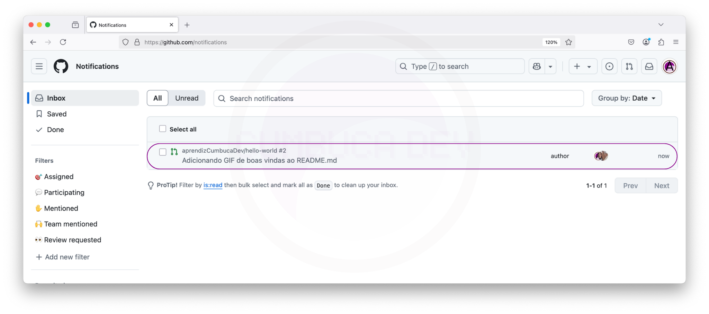<figcaption></figcaption></figure>

Ou, acessando diretamente o Histórico de Ações da [10.4.1-aba-conversation.md](../../10.4-pagina-de-um-pull-request-no-github/10.4.1-aba-conversation.md "mention") do PR.

<figure>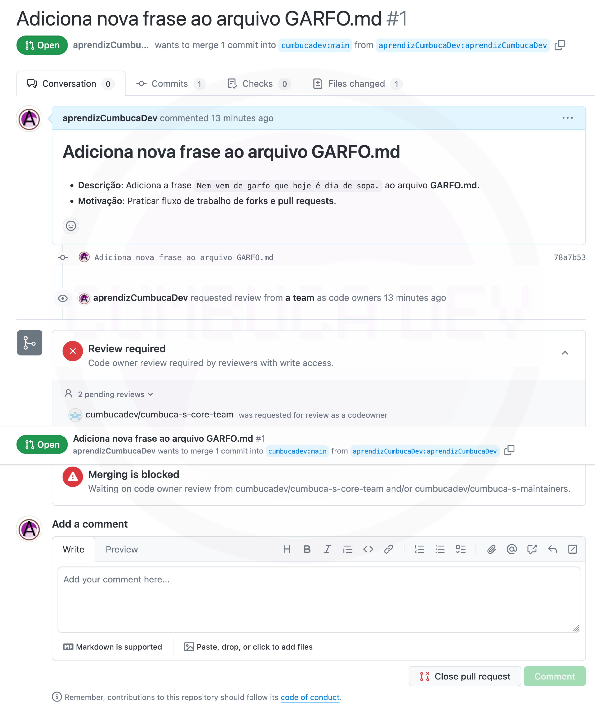<figcaption></figcaption></figure>

O resultado da revisão foi: `❌ Solicitação de Alterações` . Além disso, há um comentário geral sobre o PR que diz:

> O PR está ótimo! Amei o gif do pinguim 🐧 Deixei apenas uma sugestão de alteração.

E um comentário contendo a sugestão que diz:

> Muitas ferramentas de programação processam arquivos linha por linha e esperam que cada uma termine com uma quebra de linha (`\n`). Quando isso não ocorre, a última linha pode ser interpretada incorretamente, causando erros ou comportamentos inesperados.
>
> Isso acontece porque muitos sistemas operacionais seguem o padrão Unix, um conjunto de regras e convenções amplamente adotado na computação. O Unix foi criado na década de 1970 e influenciou sistemas como Linux e macOS. Uma dessas convenções é que arquivos de texto devem terminar com uma quebra de linha para garantir compatibilidade com ferramentas que leem arquivos sequencialmente.
>
> Além disso, essa prática é recomendada por diversos editores de código e linters (ferramentas que analisam o código para garantir boas práticas).
>
> Por isso, sugiro adicionar uma linha vazia no final deste arquivo.
>
> Aqui estão algumas referências que explicam isso melhor:
>
> * [Por que inserir uma linha em branco no final do código?](https://pt.stackoverflow.com/questions/272449/por-que-inserir-uma-linha-em-branco-no-final-do-c%C3%B3digo)
> * [Por que arquivos devem terminar com uma quebra de linha?](https://jlozovei.dev/pt-br/blog/why-you-should-put-a-newline-at-the-end-of-your-code/)
>
> Se precisar de mais explicações, é só avisar!

**Sugestão de Alteração**: A mudança sugerida adiciona uma linha em branco ao final do arquivo README.md. Isso é uma boa prática recomendada por sistemas Unix e ferramentas de análise de código para evitar problemas de compatibilidade.\
A revisora explicou detalhadamente a importância dessa alteração e forneceu links para referências.

**Status do PR**: Uma solicitação de alteração pendente. Não há conflitos com a branch base, então o merge poderá ser feito automaticamente.

Vamos começar reagindo ao comentário positivo recebido.

<div><figure>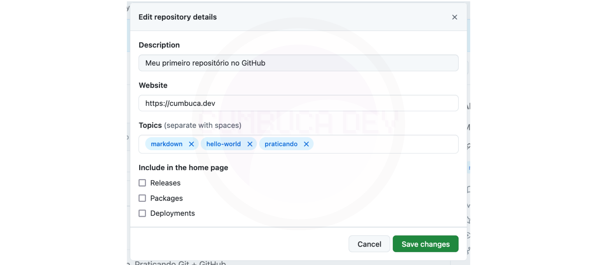<figcaption></figcaption></figure> <figure>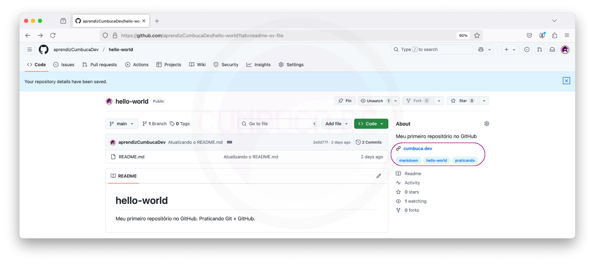<figcaption></figcaption></figure></div>

Agora, vamos analisar a sugestão oferecida.

* **Entendemos a sugestão?** Sim, a motivação e o que precisa ser feito estão bem explicados.
* **Concordamos com a sugestão?** Sim, parece ser um padrão adotado e que faz sentido.

Sendo assim, vamos aceitar a sugestão. Para isso, clicamos no botão **Commit suggestion** abaixo da sugestão.

<figure>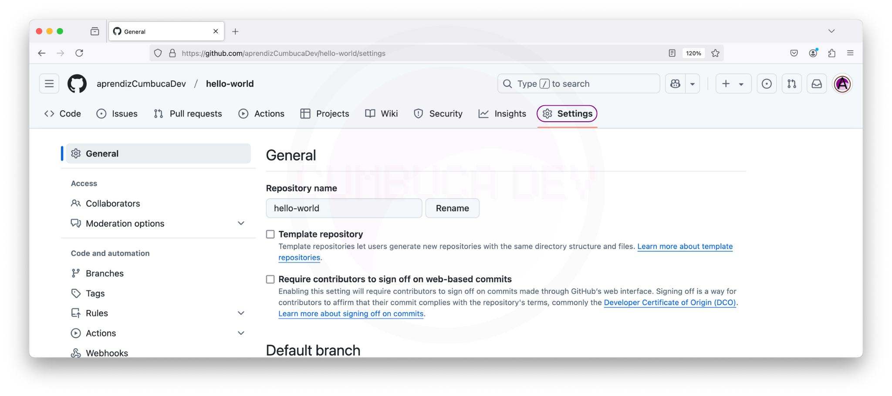<figcaption></figcaption></figure>

Na caixa de diálogo, preenchemos a mensagem principal com:

```
Adiciona linha vazia ao final do arquivo README.md
```

E a mensagem adicional com:

```
Muitas ferramentas de programação processam arquivos linha por linha e esperam que cada uma termine com uma quebra de linha (\n). Quando isso não ocorre, a última linha pode ser interpretada incorretamente, causando erros ou comportamentos inesperados.
Isso acontece porque muitos sistemas operacionais seguem o padrão Unix, um conjunto de regras e convenções amplamente adotado na computação. O Unix foi criado na década de 1970 e influenciou sistemas como Linux e macOS. Uma dessas convenções é que arquivos de texto devem terminar com uma quebra de linha para garantir compatibilidade com ferramentas que leem arquivos sequencialmente.

Além disso, essa prática é recomendada por diversos editores de código e linters (ferramentas que analisam o código para garantir boas práticas).

Referências:
- https://pt.stackoverflow.com/questions/272449/por-que-inserir-uma-linha-em-branco-no-final-do-c%C3%B3digo
- https://jlozovei.dev/pt-br/blog/why-you-should-put-a-newline-at-the-end-of-your-code/
```

Clicamos em "Commit changes". Isso cria um commit e já resolve a conversa automaticamente.

<figure>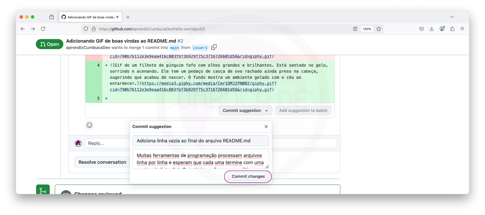<figcaption></figcaption></figure>

A página é atualizada e exibe um painel no topo com a mensagem "_Suggestion successfully applied_", indicando que a sugestão foi aplicada com sucesso.

<figure>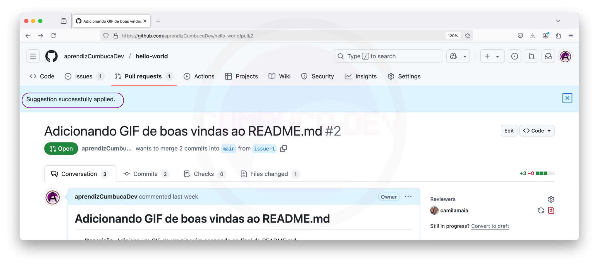<figcaption></figcaption></figure>

Podemos ver também que o novo commit já consta na seção de Histórico de Ações.

<figure>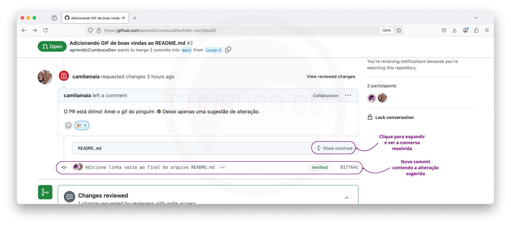<figcaption></figcaption></figure>

E que agora, na [10.4.2-aba-commits.md](../../10.4-pagina-de-um-pull-request-no-github/10.4.2-aba-commits.md "mention"), o novo commit aparece.

<div><figure><figcaption></figcaption></figure> <figure>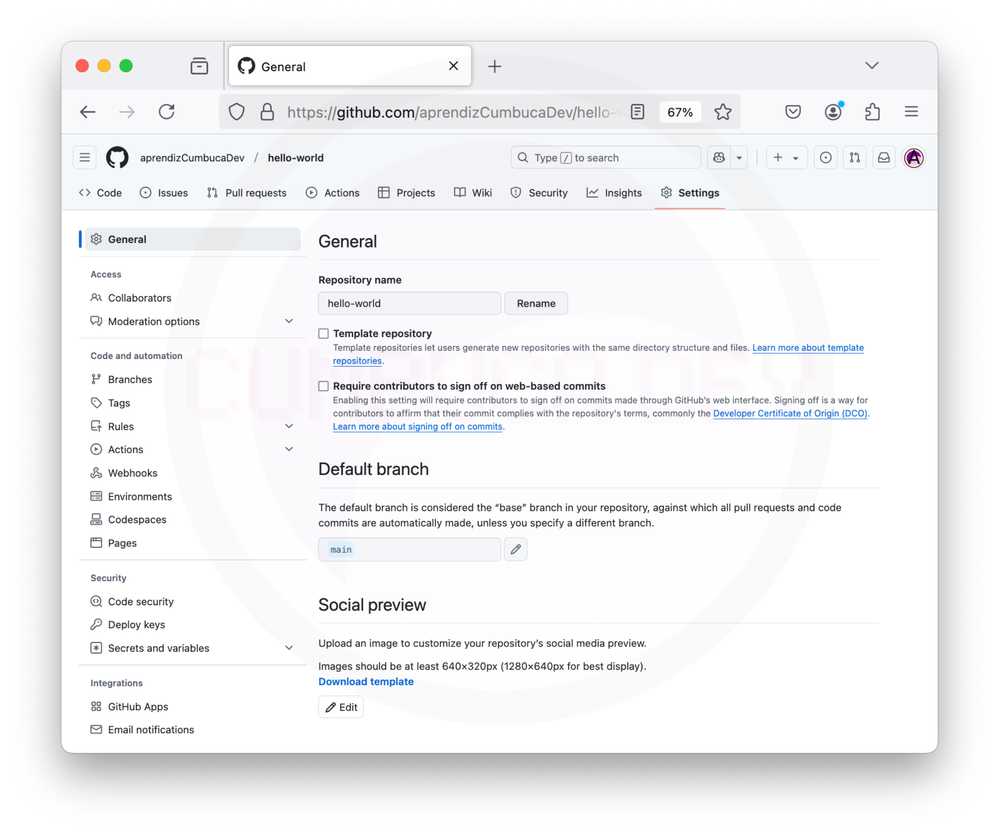<figcaption></figcaption></figure></div>

Na [10.4.4-aba-files-changed.md](../../10.4-pagina-de-um-pull-request-no-github/10.4.4-aba-files-changed.md "mention"), onde o comentário com a sugestão estava presente, agora há um painel com a mensagem "_**aprendizCumbucaDev** marked this conversation as resolved_", indicando que a conversa foi marcada como resolvida pela conta **aprendizCumbucaDev** (feito automaticamente ao aceitar a sugestão).

<figure>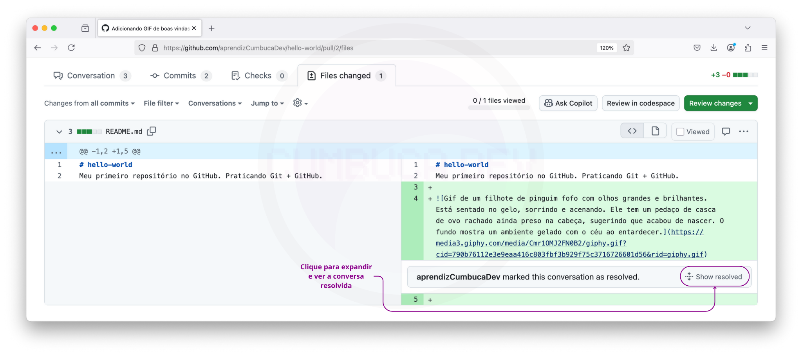<figcaption></figcaption></figure>

Por fim, re-solicitamos a revisão da conta **camilamaia**.

<figure>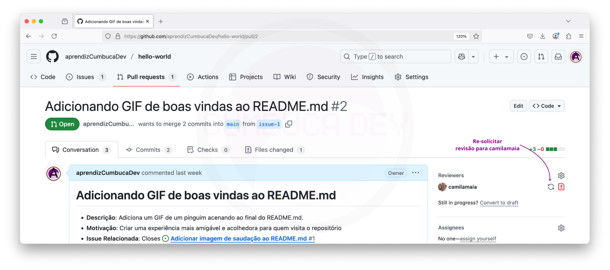<figcaption></figcaption></figure>

<figure>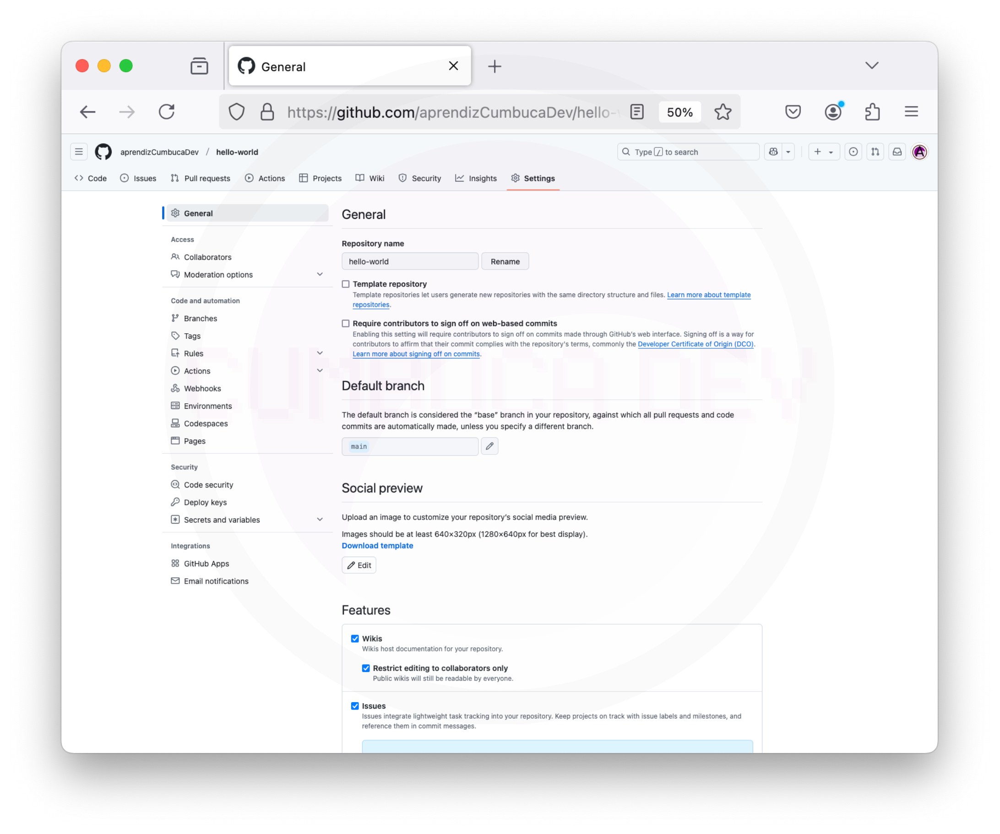<figcaption></figcaption></figure>

E, **camilamaia** aprova o PR 🎉

<figure>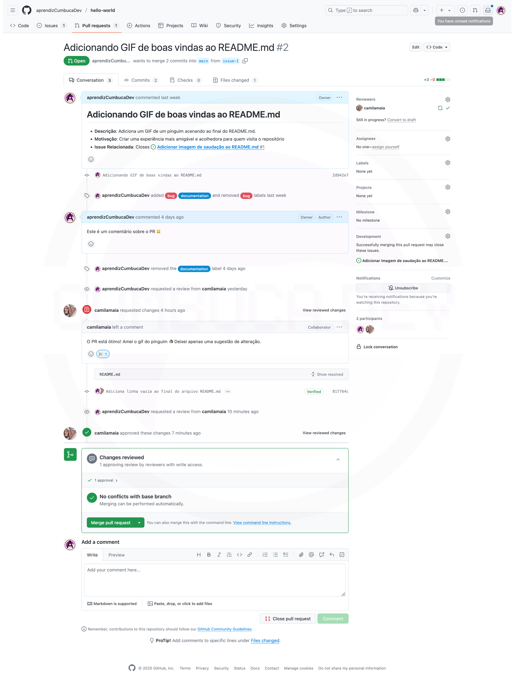<figcaption></figcaption></figure>

***

Agora, a revisão está completa! Nas próximas seções, vamos aprender como mesclar um PR ao branch principal.
