# 17.3.3 Realizando Alterações Localmente

Dando continuidade ao processo de contribuição com forks e pull requests, é hora de realizar as alterações necessárias localmente. Para isso, vamos seguir as instruções contidas no arquivo **README.md** do fork.

<figure>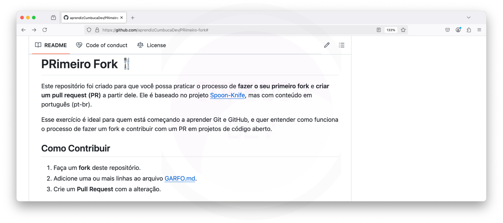<figcaption></figcaption></figure>

> ### PRimeiro Fork 🍴
>
> Este repositório foi criado para que você possa praticar o processo de fazer o seu primeiro fork e criar um pull request (PR) a partir dele. Ele é baseado no projeto Spoon-Knife, mas com conteúdo em português (pt-br).
>
> #### Como Contribuir
>
> Esse exercício é ideal para quem está começando a aprender Git e GitHub, e quer entender como funciona o processo de fazer um fork e contribuir com um PR em projetos de código aberto.
>
> 1. Faça um fork deste repositório.
> 2. Adicione uma ou mais linhas ao arquivo GARFO.md.
> 3. Crie um Pull Request com a alteração.

O **passo 1** já foi realizado. Agora, vamos focar no próximo passo: adicionar uma linha ao arquivo **GARFO.md**. Para isso, seguiremos um processo muito parecido com o que abordamos nas seções [9.3.3.2-editando-readme-md.md](../../15-git-remoto/9.3-interagindo-com-o-repositorio-remoto-hello-world/9.3.3-alterando-hello-world-localmente/9.3.3.2-editando-readme-md.md "mention") e [9.3.3.3-salvando-alteracoes-no-controle-de-versao-local.md](../../15-git-remoto/9.3-interagindo-com-o-repositorio-remoto-hello-world/9.3.3-alterando-hello-world-localmente/9.3.3.3-salvando-alteracoes-no-controle-de-versao-local.md "mention"):

1. [#editar-o-arquivo-garfo.md](11.2.3-realizando-alteracoes-localmente.md#editar-o-arquivo-garfo.md "mention")
2. [#salvar-alteracoes-no-controle-de-versao-local](11.2.3-realizando-alteracoes-localmente.md#salvar-alteracoes-no-controle-de-versao-local "mention")

## Editar o Arquivo GARFO.md

### 1. Abrindo o Visual Studio Code

O primeiro passo é abrir a aplicação Visual Studio Code (visto em[9.3.3.1-editor-de-codigo.md](../../15-git-remoto/9.3-interagindo-com-o-repositorio-remoto-hello-world/9.3.3-alterando-hello-world-localmente/9.3.3.1-editor-de-codigo.md "mention"))**.**

Ao abrir o VSCode, será exibida a aba **Bem-vindo**. Essa aba apresenta atalhos para abrir projetos, acessar documentação e personalizar o editor.

<figure>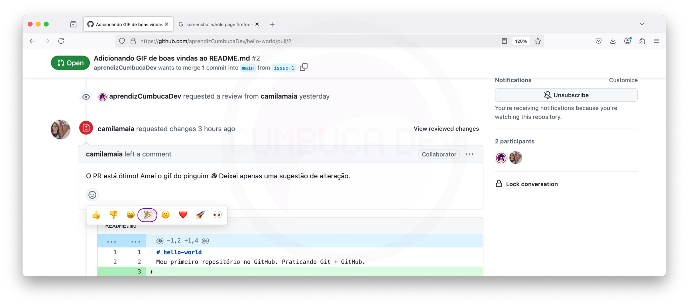<figcaption></figcaption></figure>

No entanto, não iremos utilizá-la agora, então pode fechá-la clicando no **X** no canto da aba.

<figure>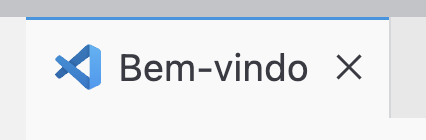<figcaption></figcaption></figure>

O editor ficará assim:

<figure>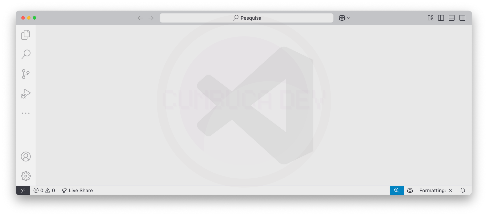<figcaption></figcaption></figure>

### 2. Abrindo a pasta do repositório

Agora, abra a pasta do repositório no editor. Para isso, clique em **Arquivo** na barra de menu no topo da tela.

<figure>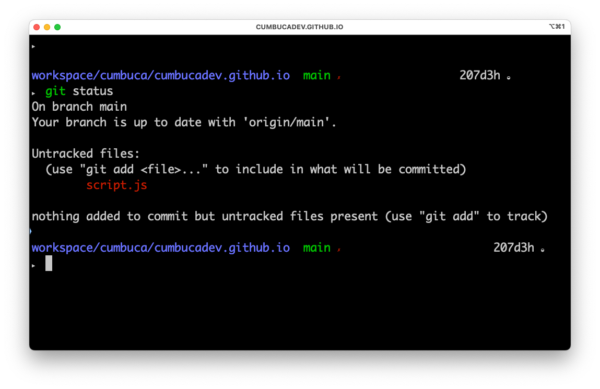<figcaption></figcaption></figure>

Selecione **Abrir Pasta...**.

<figure>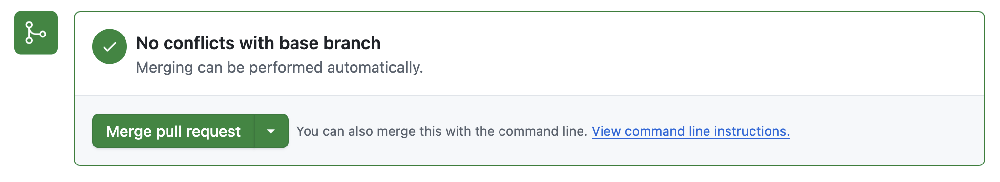<figcaption></figcaption></figure>

Encontre a pasta do repositório `PRimeiro-fork`, selecione-a e clique em **Abrir**.

<figure>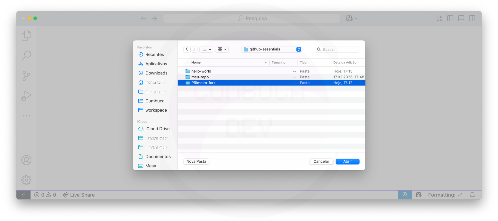<figcaption></figcaption></figure>

### 3. Abrindo o arquivo GARFO.md

Na barra lateral esquerda, clique no arquivo **GARFO.md** para abri-lo.

<figure>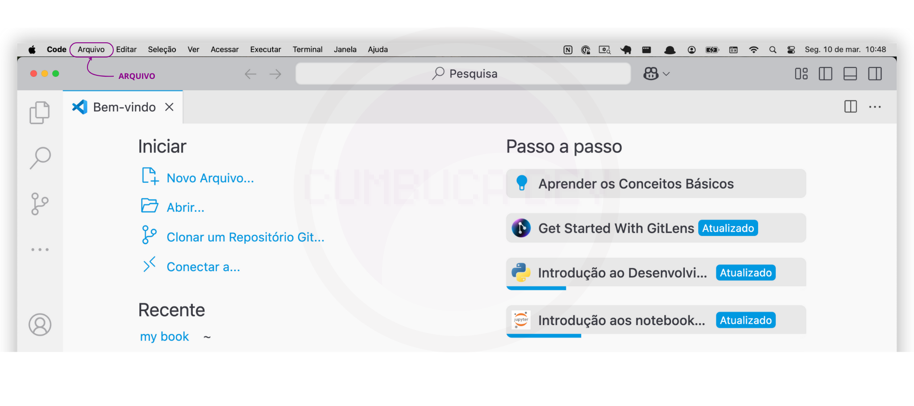<figcaption></figcaption></figure>

O conteúdo do arquivo será mostrado no painel central da tela, onde você poderá editá-lo.

<figure>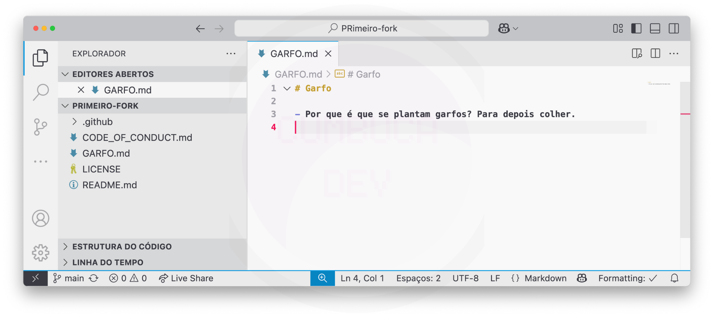<figcaption></figcaption></figure>

Antes de começarmos a edição, vamos visualizar como o arquivo fica formatado. Para isso:

1. Clique no ícone de **Pré-Visualização** no canto superior direito.\
   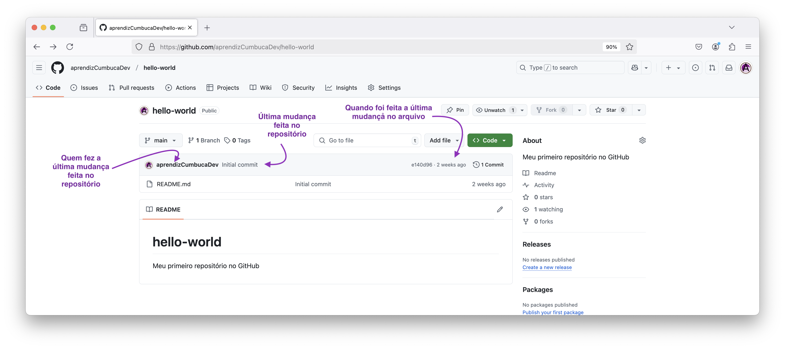
2. O VSCode abrirá uma visualização formatada do Markdown ao lado direito, mostrando como o arquivo será exibido no GitHub.

<figure><figcaption></figcaption></figure>

Agora, temos três principais áreas visíveis no editor:

* **Barra lateral esquerda**: Lista os arquivos do repositório.
* **Painel central**: Área onde editamos o GARFO.md.
* **Painel da direita**: Pré-visualização do Markdown formatado.

### 4. Editando o arquivo

Agora, escreva uma frase logo abaixo da última linha com texto. Fique à vontade para escrever o que quiser, sobre qualquer tema. E não se esqueça de deixar uma linha em branco no final do arquivo.

Neste caso, vamos adicionar a frase `Nem vem de garfo que hoje é dia de sopa.` .

O arquivo ficará assim:

```
# Garfo

- Por que é que se plantam garfos? Para depois colher.
- Nem vem de garfo que hoje é dia de sopa.

```

<figure>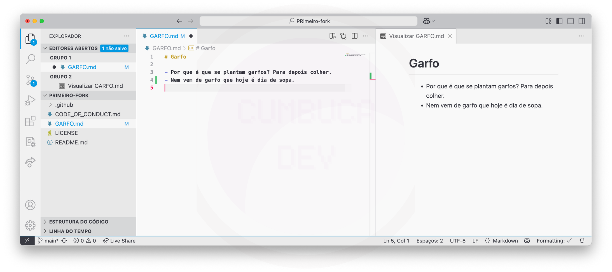<figcaption></figcaption></figure>

### 5. Salvando o arquivo

Por fim, não se esqueça de salvar as alterações no arquivo **GARFO.md**. Para isso, clique em **Arquivo** no menu superior.

<figure><figcaption></figcaption></figure>

E, selecione a opção **Salvar**.

<figure>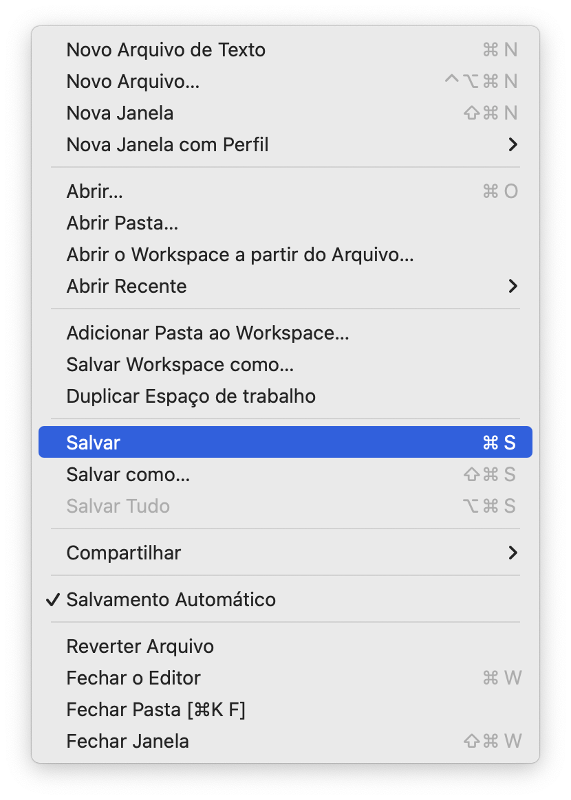<figcaption></figcaption></figure>

<figure>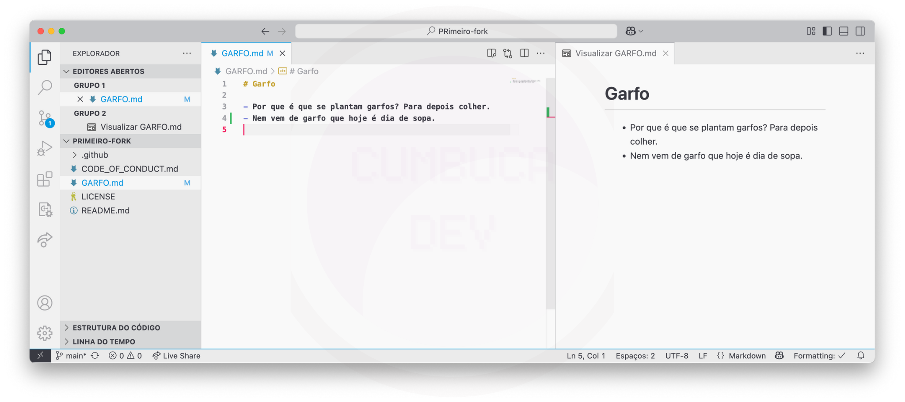<figcaption></figcaption></figure>

## Salvar Alterações no Controle de Versão Local

Agora, vamos registrar as alterações no repositório Git local utilizando um novo branch.

### 1. Verificar estado atual do repositório

Antes de prosseguir, verifique o status do repositório com <mark style="color:purple;">git</mark> <mark style="color:orange;">status</mark>.

```bash
git status
▶ On branch main
Your branch is up to date with 'origin/main'.

Changes not staged for commit:
  (use "git add <file>..." to update what will be committed)
  (use "git restore <file>..." to discard changes in working directory)
	modified:   GARFO.md

no changes added to commit (use "git add" and/or "git commit -a")
```

O estado atual do GARFO.md é _**tracked**_ e _**modified**, &#x75;_&#x6D;a vez que o arquivo foi modificado anteriormente com a adição da nova linha.

### 2. Criar um novo branch

Como o projeto é apenas para fins didáticos, e não existe nenhuma documentação sugerindo como deve ser o padrão para nomes de branches, podes escolher como preferirmos.

Então, crie um novo branch com o nome de sua conta de usuário ou o quê preferir. Aqui, iremos utilizar `aprendizCumbucaDev` e alterne para ele.

```bash
git switch -C aprendizCumbucaDev
▶ Switched to a new branch 'aprendizCumbucaDev'
```

### 3. Verificar estado atual do repositório

Ao verificar o estado do repositório, agora a primeira linha retornada deve ser `On branch aprendizCumbucaDev` ao a invés de `On branch main`.

```bash
git status
▶ On branch aprendizCumbucaDev
Changes not staged for commit:
  (use "git add <file>..." to update what will be committed)
  (use "git restore <file>..." to discard changes in working directory)
	modified:   GARFO.md

no changes added to commit (use "git add" and/or "git commit -a")
```

O estado atual do GARFO.md permanece _**tracked**_ e _**modified**._

### 4. Adicionar GARFO.md

Agora, adicione o arquivo ao **staging area**, preparando-o para o commit.

```bash
git add GARFO.md
```

### 5. Verificar estado atual do repositório

Verifique novamente o estado do repositório.

```bash
git status
▶ On branch aprendizCumbucaDev
Changes to be committed:
  (use "git restore --staged <file>..." to unstage)
	modified:   GARFO.md
```

O estado do GARFO.md agora é **tracked e staged**.

### 6. Git commit

Agora, salve as alterações no histórico do Git com um commit.

```bash
git commit -m 'Adiciona nova frase ao arquivo GARFO.md'
▶ [aprendizCumbucaDev 78a7b53] Adiciona nova frase ao arquivo GARFO.md
 1 file changed, 1 insertion(+)
```

### 7. Verificando o log do repositório

Para confirmar que o commit foi registrado corretamente, utilize o comando:

```bash
git log
```

Saída esperada (algo como):

```bash
commit 78a7b537180143644eb19ec64cb33106fcbdf8c6 (HEAD -> aprendizCumbucaDev)
Author: aprendizCumbucaDev <aprendiz.cumbucadev@gmail.com>
Date:   Sat Mar 29 19:22:21 2025 -0300

    Adiciona nova frase ao arquivo GARFO.md

commit 30352b88ddf5b790e49075c5c0d180e48afea333 (origin/main, origin/HEAD, main)
Author: Camila Maia <cmaiacd@gmail.com>
Date:   Wed Mar 26 14:05:01 2025 -0300

    Adiciona instruções aos usuários

...
```

Note que o seu último commit aparece apenas no branch `aprendizCumbucaDev`, indicado por `(HEAD -> aprendizCumbucaDev)`. Isso significa que seu novo commit está apenas no branch `aprendizCumbucaDev`, enquanto o branch `main` local ainda está alinhado com o repositório remoto.

***

A seguir, vamos enviar as modificações salvas localmente para o seu fork remoto.
