---
layout:
  width: default
  title:
    visible: true
  description:
    visible: false
  tableOfContents:
    visible: true
  outline:
    visible: true
  pagination:
    visible: true
  metadata:
    visible: true
---

# 2.4.1 Exemplo de fluxo de trabalho

Para deixar essa dinâmica mais concreta, vamos acompanhar um exemplo simples: Alex e Sam criando juntos um blog.

No início, apenas Alex começa o projeto. Em sua própria máquina local, Alex cria os primeiros arquivos: a página inicial, a estrutura básica do site e um primeiro post. Nesse momento, o projeto ainda existe apenas no computador de Alex.

<figure>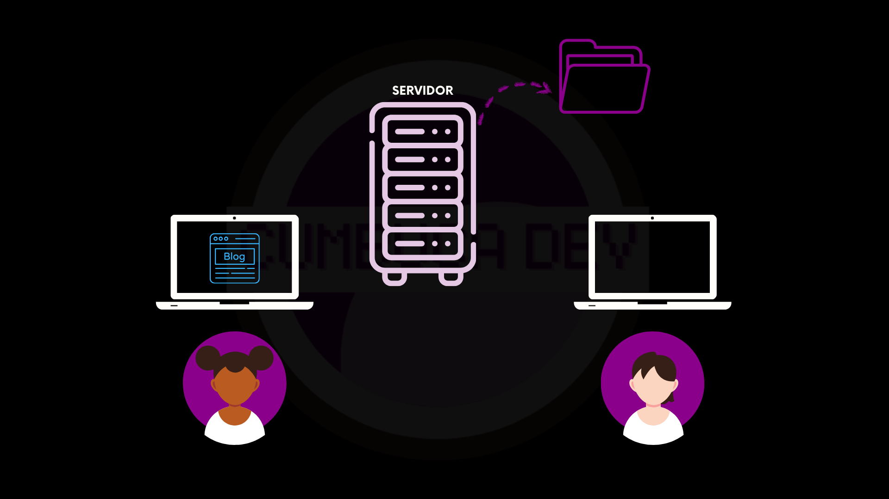<figcaption></figcaption></figure>

Enquanto o projeto está só na máquina de Alex, Sam não consegue colaborar. Se o computador quebrar, se os arquivos forem apagados ou se Alex simplesmente não estiver disponível, o projeto fica inacessível.

Por isso, quando o blog atinge um ponto em que faz sentido compartilhar, Alex envia esses arquivos para o servidor. A partir desse momento, o servidor passa a ser o lugar central que guarda a versão oficial do projeto.

<figure>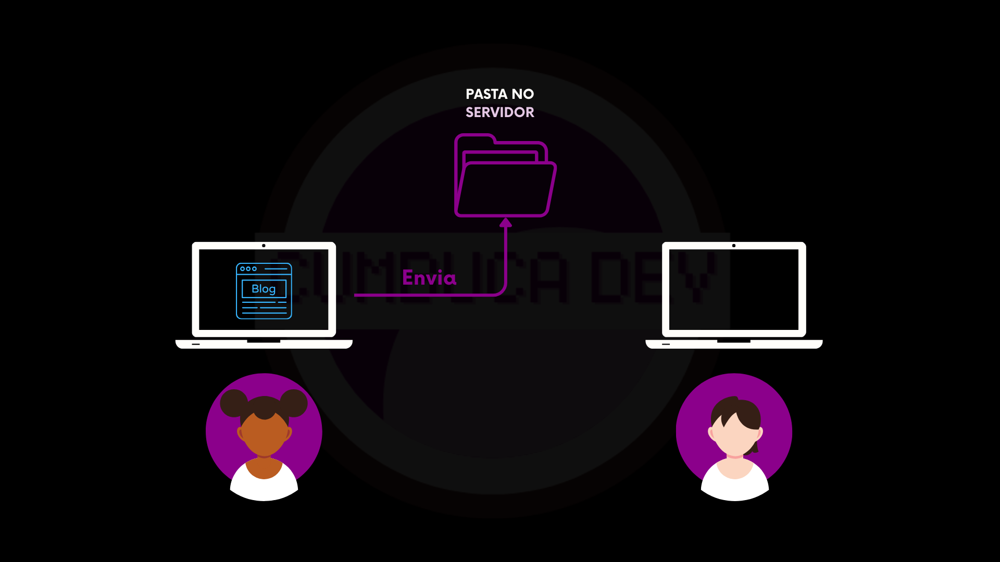<figcaption></figcaption></figure>

Esse envio cria a **primeira versão do projeto** no repositório. Essa versão fica registrada com informações importantes: quem criou, quando foi criada e quais arquivos fazem parte dela.

<figure><figcaption></figcaption></figure>

Agora que o projeto está no servidor, Sam pode começar a colaborar. Para isso, Sam se conecta ao servidor e copia os arquivos do blog para a própria máquina local.

<figure>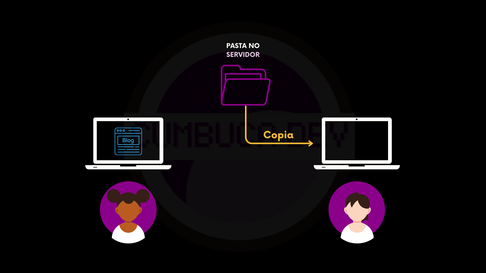<figcaption></figcaption></figure>

A partir desse ponto, tanto Alex quanto Sam passam a ter uma cópia completa do blog em seus próprios computadores. Cada pessoa pode trabalhar de forma independente, sem interferir diretamente no trabalho da outra.

<figure>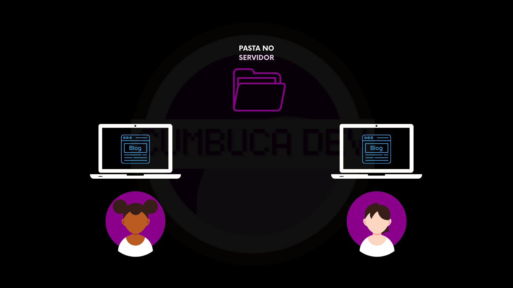<figcaption></figcaption></figure>

Sam decide criar um novo post para o blog. Sam escreve o texto, ajusta o conteúdo e salva tudo localmente, apenas na própria máquina.

<figure><figcaption></figcaption></figure>

Quando termina, Sam envia suas alterações para o repositório no servidor.

<figure>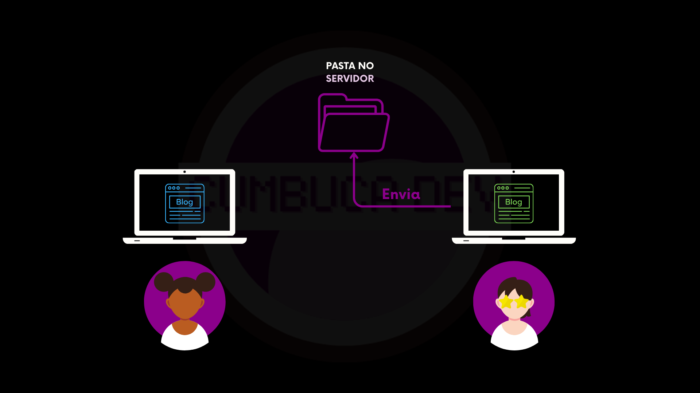<figcaption></figcaption></figure>

Agora, o servidor passa a ter **duas versões do projeto**: a versão 1, com apenas a estrutura inicial, e a versão 2, que inclui a estrutura inicial mais o novo post criado por Sam.

<figure>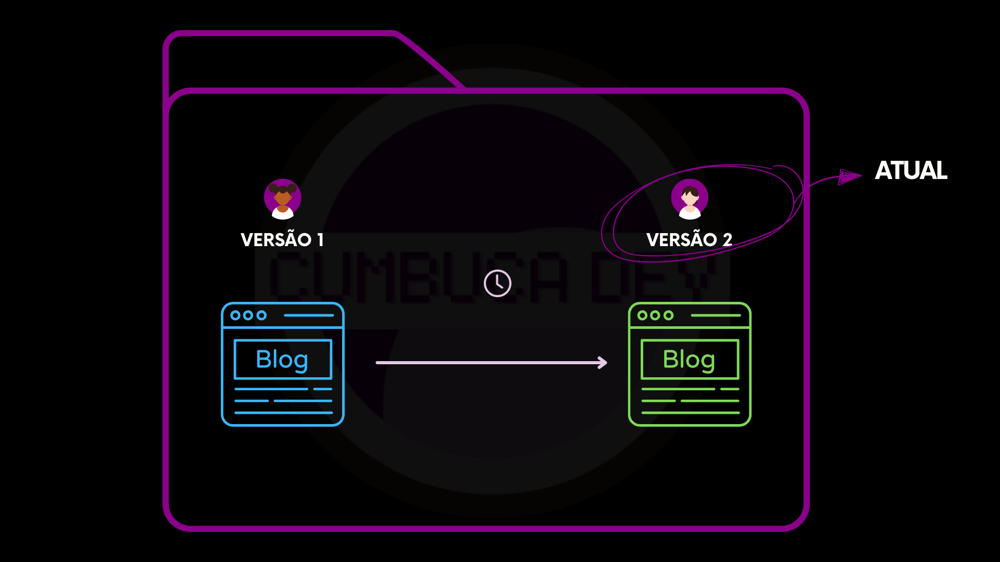<figcaption></figcaption></figure>

Enquanto isso, sem saber da mudança, Alex também estava criando um novo post na própria máquina local.

<figure><figcaption></figcaption></figure>

Quando Alex tenta enviar suas alterações para o servidor, encontra um erro.

<figure>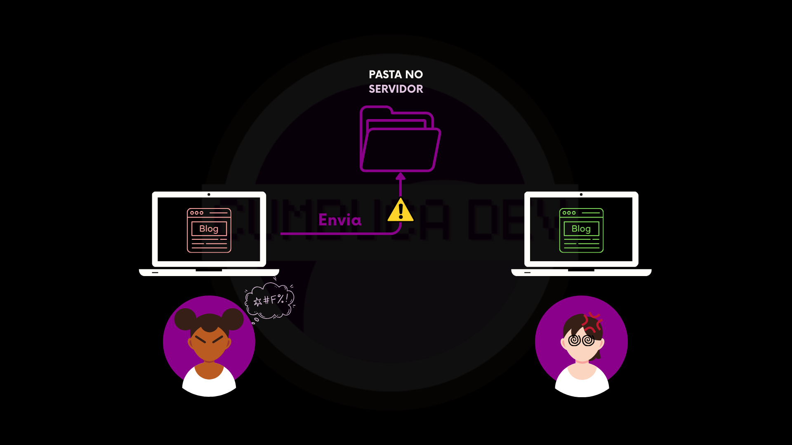<figcaption></figcaption></figure>

Esse erro acontece porque o servidor já possui uma versão mais recente do projeto, a versão 2, que foi enviada por Sam. O sistema não permite que Alex sobrescreva essa versão sem antes atualizar a própria cópia.

Antes de enviar qualquer coisa, Alex precisa primeiro **atualizar o projeto**, trazendo para a máquina as mudanças mais recentes do servidor.

<figure>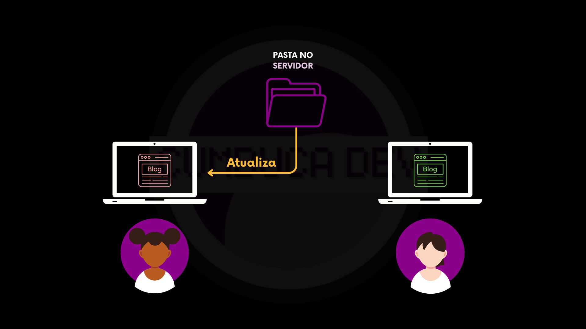<figcaption></figcaption></figure>

Nesse momento ocorre a **mesclagem**. O sistema junta a versão 2 do servidor com as alterações que estavam apenas na máquina de Alex.

<figure><figcaption></figcaption></figure>

Agora, Alex passa a ter, na máquina local, uma versão mesclada do projeto, contendo os dois posts.

<figure><figcaption></figcaption></figure>

Só então Alex consegue enviar as alterações para o servidor.

<figure>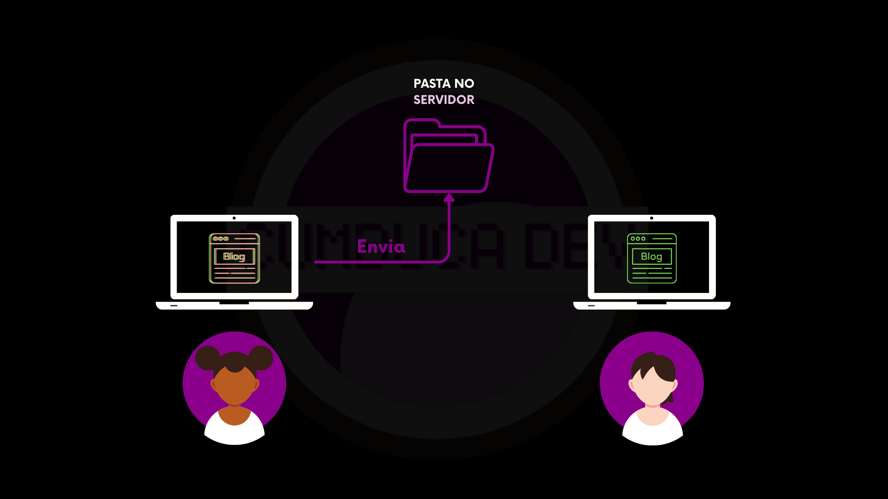<figcaption></figcaption></figure>

Esse envio cria a **versão 3 do projeto** no repositório.

<figure>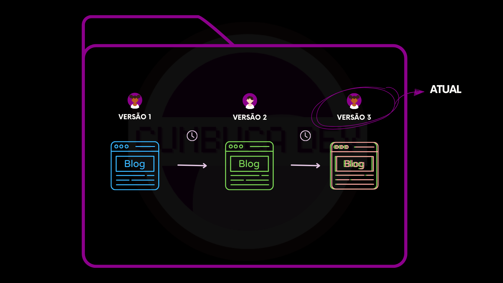<figcaption></figcaption></figure>

Agora, Sam pode atualizar a própria máquina com essa nova versão.

<figure>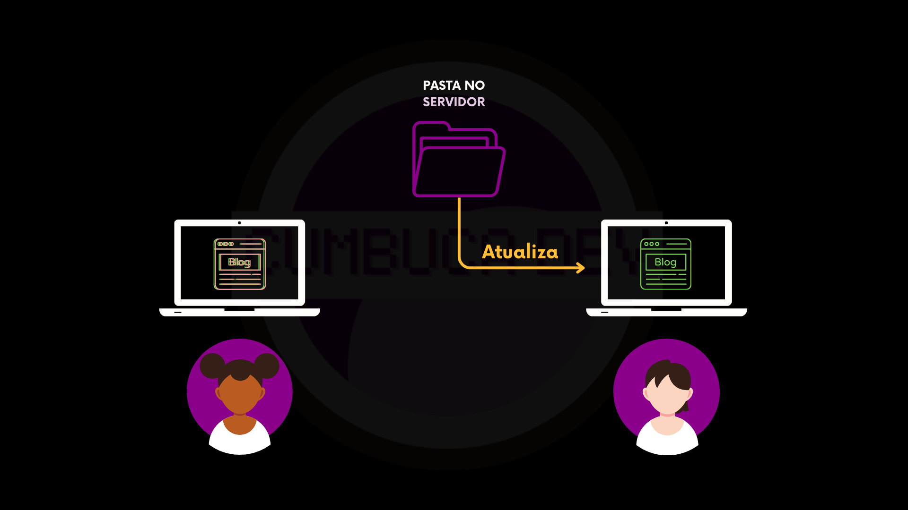<figcaption></figcaption></figure>

E assim, tanto Alex quanto Sam passam a ter novamente a mesma versão do projeto, agora contendo os dois posts.

<figure><figcaption></figcaption></figure>

Em resumo, neste modelo, o projeto vive em um único lugar: o servidor central. Cada pessoa trabalha em sua própria cópia local, mas sempre que quer registrar uma mudança precisa enviá-la para esse servidor. É nele que fica a versão oficial do projeto, e é a partir dele que todas as pessoas se atualizam para obter as mudanças feitas por outras. A figura abaixo ilustra essa dinâmica: vários computadores conectados a um único repositório central, que concentra o histórico e as versões do projeto.

<figure>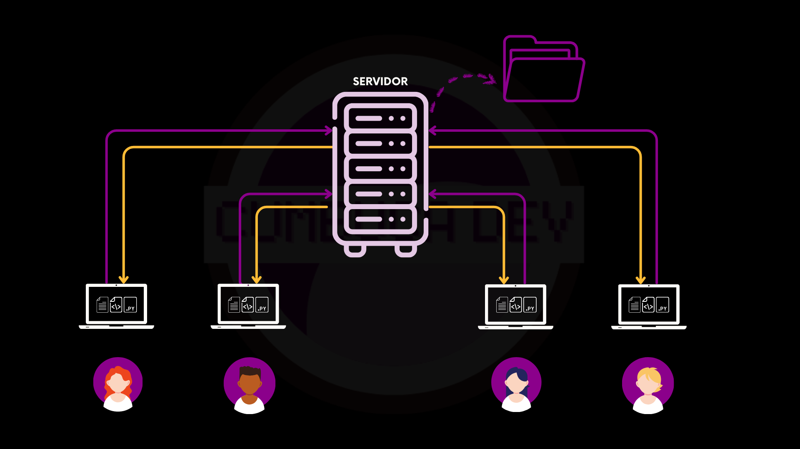<figcaption></figcaption></figure>

***

A seguir, vamos olhar com mais atenção para as limitações dos sistemas centralizados, entendendo quais problemas esse modelo apresenta no dia a dia e por que ele começou a não ser suficiente para muitos tipos de projeto.
