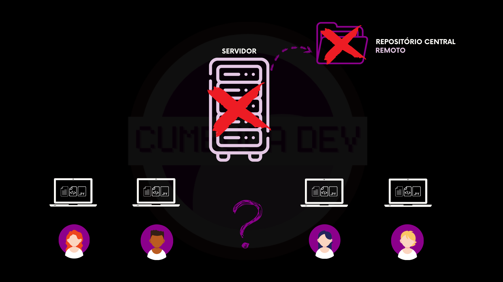
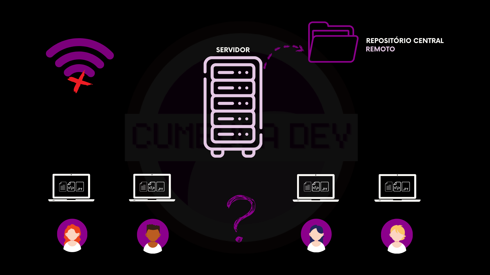
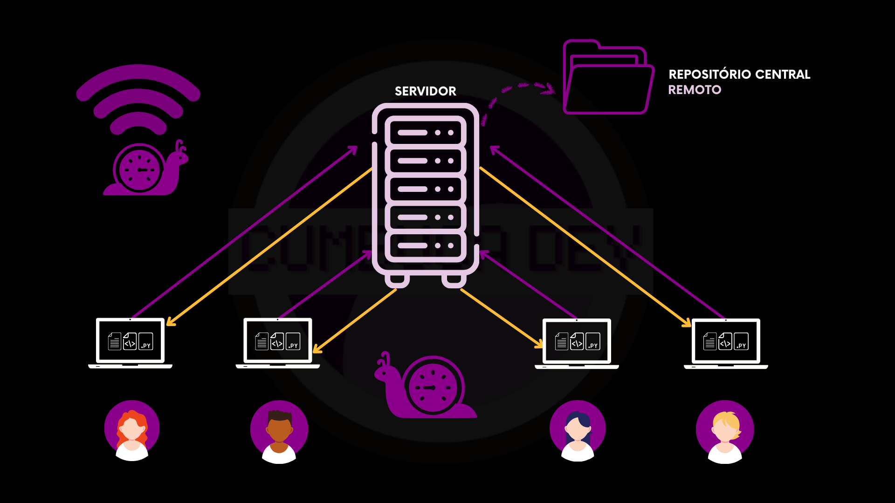
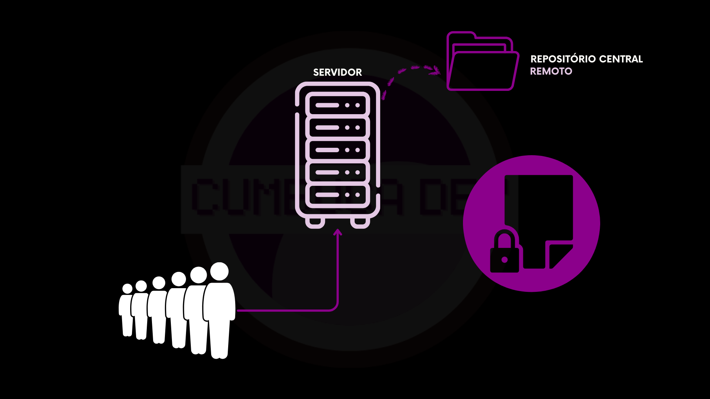

---
layout:
  width: default
  title:
    visible: true
  description:
    visible: false
  tableOfContents:
    visible: true
  outline:
    visible: true
  pagination:
    visible: true
  metadata:
    visible: true
---

# 2.4.2 Limitações

Até aqui, vimos como funcionam os Sistemas de Controle de Versão Centralizados e como eles organizam o trabalho em equipe. Esse modelo resolveu muitos problemas importantes na época em que surgiu, principalmente em relação ao controle de histórico e colaboração básica.

No entanto, à medida que os projetos ficaram maiores, as equipes cresceram e a internet passou a ser parte essencial do trabalho, algumas limitações desse modelo começaram a ficar mais evidentes. Entender essas limitações é fundamental para compreender por que outros modelos surgiram depois.

## Um único ponto de falha coloca em risco os dados

No modelo centralizado, todo o histórico do projeto fica armazenado em um único lugar: o servidor.

Se algo acontecer com esse servidor, como uma falha de hardware, um erro humano, um ataque ou até a perda de backups, todo o repositório pode ser comprometido. Isso significa não apenas perder a versão atual do código, mas também todo o histórico de mudanças construído ao longo do tempo.

Na prática, o servidor se torna um **ponto único de falha**. Se ele cair, todo o projeto fica em risco.

<figure><figcaption></figcaption></figure>

## Necessidade de conexão com o servidor

Em sistemas centralizados, quase todas as operações importantes dependem do acesso ao servidor. Para enviar mudanças, atualizar arquivos ou até consultar o histórico completo, é preciso estar conectado a ele.

Se a internet cair, se a rede estiver instável ou se o servidor ficar temporariamente indisponível, o trabalho simplesmente para. Mesmo que a pessoa tenha os arquivos na própria máquina, ela não consegue registrar novas versões nem sincronizar com o restante da equipe.

Isso cria uma forte dependência da infraestrutura e limita bastante o trabalho offline.

<figure><figcaption></figcaption></figure>

## Conexão lenta atrasa o desenvolvimento

Como o servidor é o centro de tudo, muitas ações exigem comunicação constante com ele. Cada envio de mudança, cada atualização e cada consulta ao histórico precisam passar pela rede.

Em conexões lentas, isso torna o processo cansativo e demorado. Operações simples passam a levar muito mais tempo do que deveriam, o que afeta diretamente a produtividade da equipe.

Em projetos grandes, com muitos arquivos, esse problema fica ainda mais perceptível.

<figure><figcaption></figcaption></figure>

## Poucos momentos seguros para compartilhar mudanças

Em sistemas centralizados, só existe um lugar oficial para registrar alterações: o servidor. Isso faz com que as pessoas precisem esperar suas mudanças estarem realmente prontas antes de enviá-las. Enquanto isso, o código fica apenas na máquina local, invisível para o restante da equipe.

Além disso, como mencionado anteriormente, muitos sistemas centralizados trabalham com **lock (bloqueio)** de arquivos. Isso significa que, enquanto uma pessoa edita um arquivo, as demais precisam esperar para poder mexer nele.

Na prática, isso reduz ainda mais os momentos em que é possível trabalhar e compartilhar mudanças ao mesmo tempo. Alguém precisa esperar outra pessoa terminar ou adiar suas próprias alterações.

Com isso, o trabalho fica mais lento, mais sequencial e menos colaborativo do que poderia ser.

<figure><figcaption></figcaption></figure>

***

De forma geral, os sistemas centralizados funcionam bem para equipes pequenas e projetos simples, mas apresentam problemas importantes em cenários mais complexos. O fato de existir um único ponto central cria riscos para os dados, dependência constante de conexão, lentidão em redes fracas e menos liberdade para experimentar, errar e compartilhar mudanças com frequência.

Essas limitações abriram espaço para o surgimento de outro modelo, que distribui melhor a responsabilidade, reduz a dependência de um único servidor e oferece mais autonomia para cada pessoa da equipe. É justamente esse modelo que vamos começar a explorar a seguir.
