---
layout:
  width: default
  title:
    visible: true
  description:
    visible: false
  tableOfContents:
    visible: true
  outline:
    visible: true
  pagination:
    visible: true
  metadata:
    visible: true
---

# 2.5.1 Exemplo de fluxo de trabalho

Para entender melhor, vamos acompanhar como seria o fluxo de trabalho de duas pessoas usando um Sistema de Controle de Versão Distribuído

Ariel e Kim estão colaborando em um projeto que já existe em um repositório remoto, um servidor online. O projeto contém três arquivos de formatos diferentes: um `.txt`, um `.html` e um `.py`. Os formatos em si não são importantes neste momento; o essencial é que o sistema funciona para qualquer tipo de arquivo.

No início, Ariel precisa começar a trabalhar, então faz uma cópia do projeto para a própria máquina.

<figure>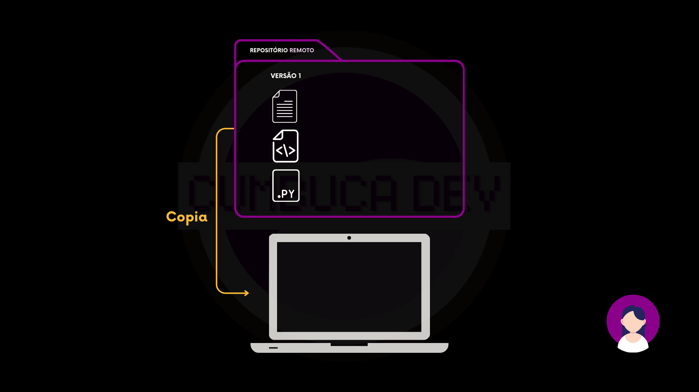<figcaption></figcaption></figure>

Agora Ariel tem uma versão local do projeto, com todos os arquivos disponíveis para abrir e modificar, e também o repositório local, que mantém o histórico de todas as alterações.

<figure>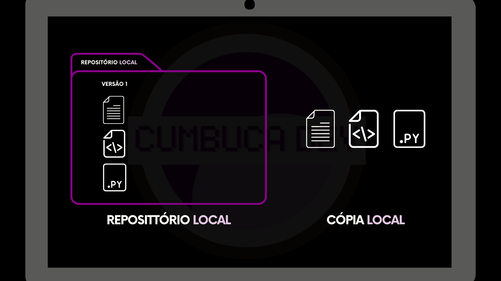<figcaption></figcaption></figure>

<figure>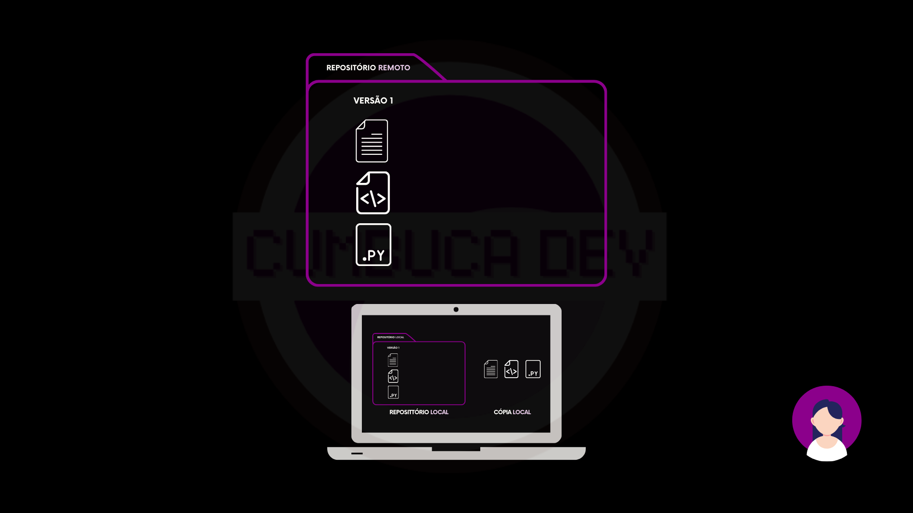<figcaption></figcaption></figure>

Depois de analisar os arquivos, Ariel decide modificar um deles. Essa alteração muda apenas a cópia local, sem afetar o repositório ainda.

<figure>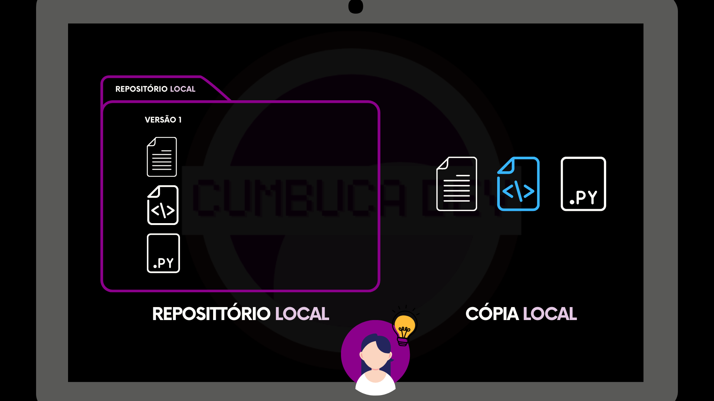<figcaption></figcaption></figure>

Para registrar essa mudança e manter o histórico, Ariel salva a modificação no repositório local, criando assim uma nova versão do projeto.

<figure>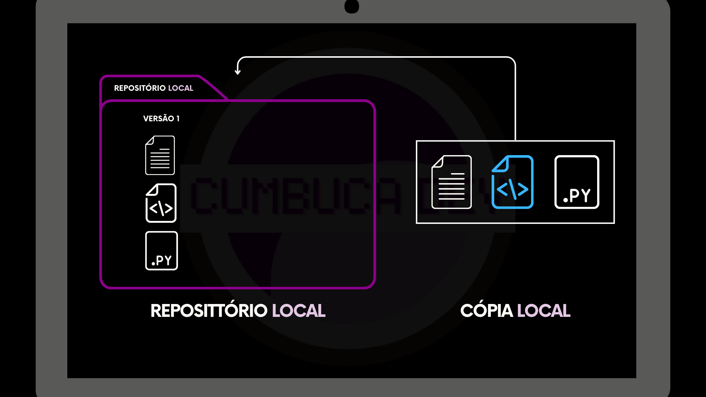<figcaption></figcaption></figure>

<figure><figcaption></figcaption></figure>

Nesse momento, a versão local de Ariel já é diferente da versão que está no repositório remoto.

IMAGEM

<figure>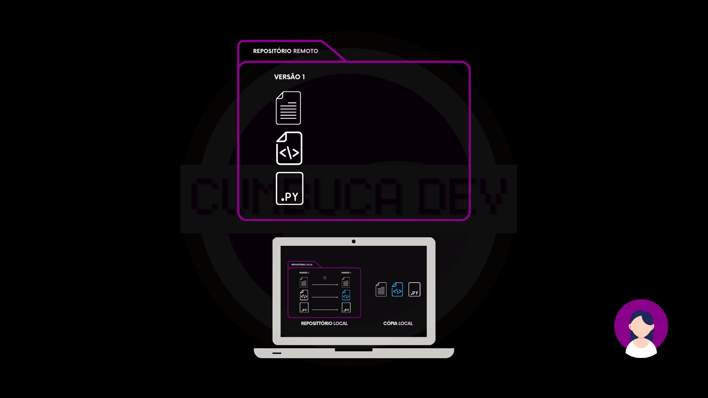<figcaption></figcaption></figure>

Para que Kim e qualquer outra pessoa tenham acesso a essa atualização, Ariel envia a nova versão para o repositório remoto.

<figure>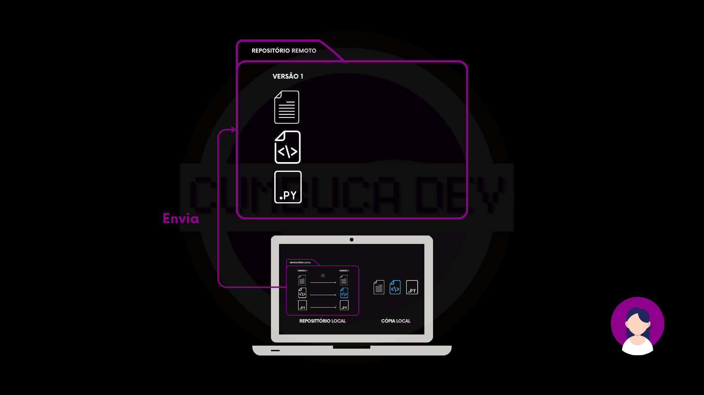<figcaption></figcaption></figure>

Com isso, o repositório remoto é atualizado e passa a conter todas as versões do projeto, incluindo a mais recente criada por Ariel.

<figure>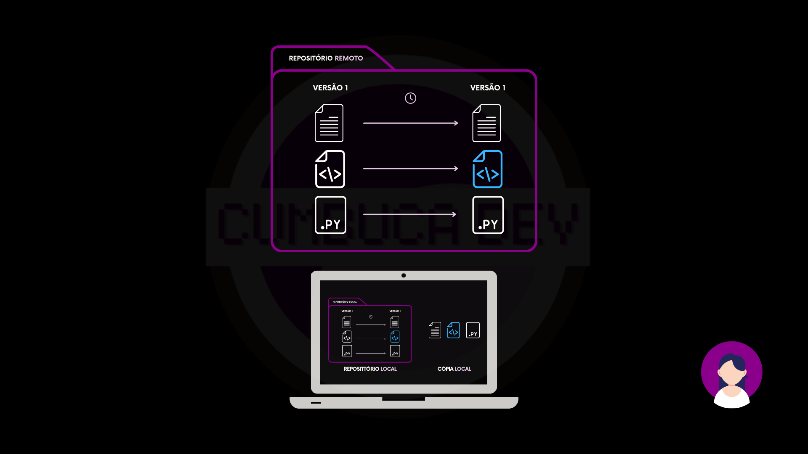<figcaption></figcaption></figure>

Enquanto isso, Kim já tinha feito uma cópia do projeto anteriormente, mas a versão local ainda não possui a alteração feita por Ariel.

<figure>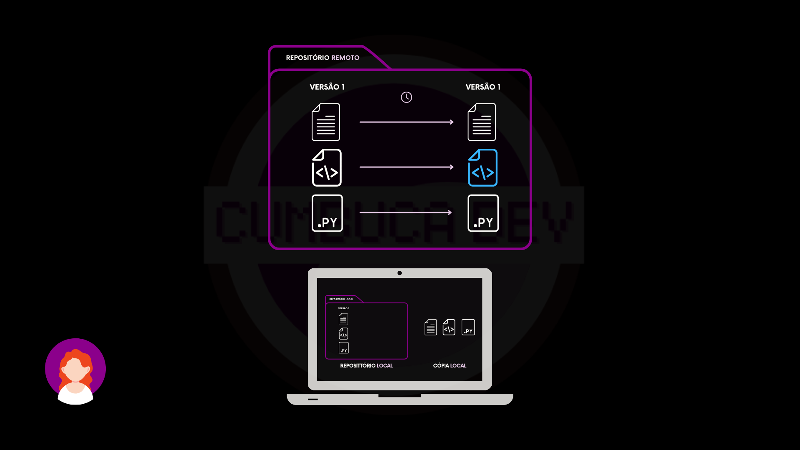<figcaption></figcaption></figure>

Para se atualizar, Kim baixa as mudanças do repositório remoto.

<figure>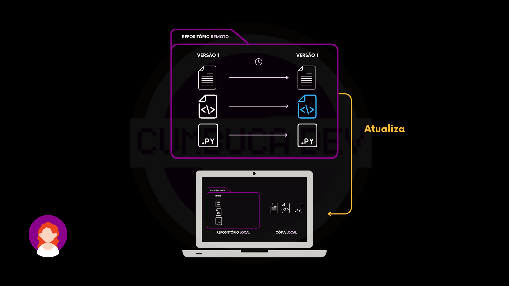<figcaption></figcaption></figure>

Depois disso, a versão local de Kim passa a ter todas as versões do projeto e a cópia no computador de Kim está sincronizada com o remoto.

<figure>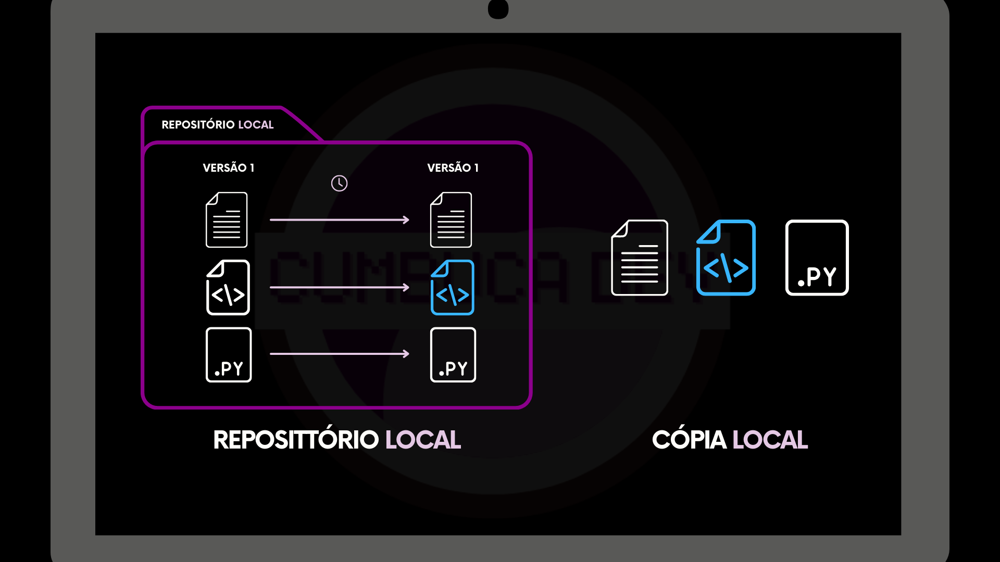<figcaption></figcaption></figure>

Com isso, Ariel e Kim têm seus ambientes locais totalmente atualizados e sincronizados com o remoto. Cada pessoa pode continuar trabalhando, criar novas versões e enviar para o repositório remoto, garantindo que todas as alterações sejam registradas e compartilhadas.

<figure>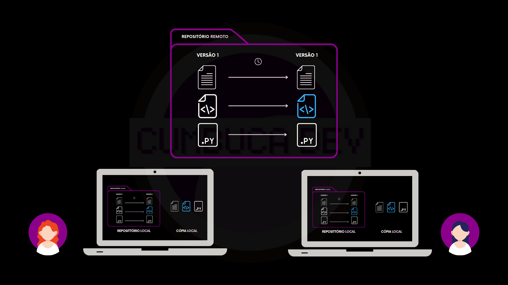<figcaption></figcaption></figure>

Dessa forma, um sistema distribuído de repositórios mantém o trabalho organizado, acessível e colaborativo para todos.

<figure>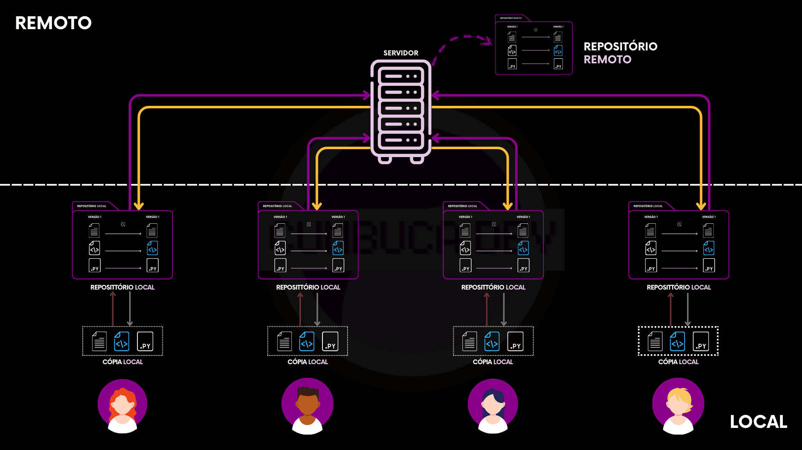<figcaption></figcaption></figure>

***

Vimos anteriormente algumas limitações do modelo centralizado, e agora conseguimos perceber como o sistema distribuído permite que cada pessoa trabalhe de forma independente, registre alterações e mantenha tudo sincronizado com o repositório remoto. A seguir, vamos explorar mais detalhadamente como esse modelo distribuído supera essas limitações.
