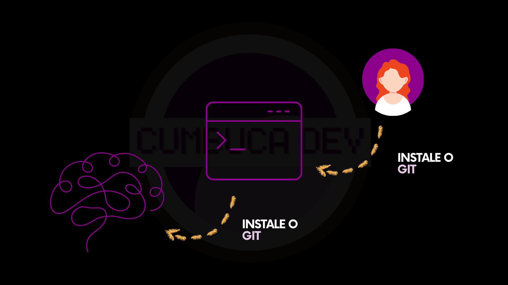

# 3.3 Instalando o Git

Antes de começar a usar o Git, você precisará instalá-lo no seu computador, pois na maioria dos sistemas ele não vem incluído por padrão.

<figure><figcaption>
Aprender sobre o Git é com a Cumbuca Dev! 💜🥥
</figcaption></figure>

## O que significa instalar algo em um computador?

O seu computador não vem com todos os programas que você pode querer ou precisar usar. Muitas vezes, é necessário adicionar programas externos para realizar determinadas tarefas. É como se você estivesse ensinando o sistema operacional a executar novas funções. Esse processo é chamado de **instalação**.

Instalar um programa significa colocar todos os arquivos necessários no seu computador e configurar o sistema para que ele funcione corretamente. Sem isso, o computador não sabe o que fazer com o programa. Ele até pode ter os arquivos, mas não consegue executá-los.

Para entender melhor, imagine como funciona os jogos de computador. Alguns jogos já vêm incluídos no sistema, como Campo Minado ou Paciência no Windows. Nesses casos, você pode jogar imediatamente, porque o computador já tem todos os arquivos e recursos necessários para que o jogo funcione.

Mas e se você quiser jogar outros jogos? Eles não estarão disponíveis no seu computador. Para poder jogar, você precisa:

* Obter o jogo, baixando-o da internet ou de outra fonte confiável
* Copiar os arquivos para o computador e instalar os recursos necessários
* Configurar o programa, para que o sistema operacional saiba como executá-lo sempre que você quiser

No caso do Git, instalar funciona da mesma maneira. Você adiciona os arquivos do programa no seu computador e configura o sistema para que possa:

* Usar o Git via linha de comando ou aplicativos que interagem com ele
* Criar e organizar projetos de forma eficiente
* Salvar e acompanhar todas as alterações que fizer no código

Ou seja, instalar o Git é o primeiro passo para começar a usar todas as funcionalidades dessa ferramenta de forma correta, segura e confiável.

## Como instalar o Git

A instalação do Git varia de acordo com o sistema operacional que você está usando. Para instalar, você basicamente dá uma ordem ao computador, seja via instalador gráfico ou linha de comando, para baixar os arquivos do Git e configurá-los no sistema.

<figure><figcaption></figcaption></figure>

## Documentação oficial

Para informações mais detalhadas e sempre atualizadas sobre o Git, consulte a [**Documentação Oficial do Git**](https://git-scm.com/doc). Ela oferece:

* Instruções completas de instalação;
* Exemplos detalhados de uso;
* Soluções para problemas comuns;
* Dicas e boas práticas.


**Dica**: sempre que for usar um programa ou linguagem de programação nova, vale a pena dedicar um tempo para explorar a documentação oficial.&#x20;

Mesmo com vídeos, tutoriais e artigos disponíveis na internet, a documentação oficial é a fonte mais confiável e completa.&#x20;

Ela mostra como usar a ferramenta corretamente, ensina boas práticas, traz exemplos detalhados e ajuda a evitar erros que você poderia cometer seguindo apenas conteúdos de terceiros. Conhecer a documentação oficial desde o início economiza tempo e facilita o aprendizado.


***

## Sua vez!

Abaixo, você encontrará instruções para os três sistemas operacionais mais comuns. **Siga apenas as instruções que correspondem ao seu caso**:

* [2.4.1-instalando-no-linux.md](2.4.1-instalando-no-linux.md "mention")
* [2.4.2-instalando-no-macos.md](2.4.2-instalando-no-macos.md "mention")
* [2.4.3-instalando-no-windows.md](2.4.3-instalando-no-windows.md "mention")
