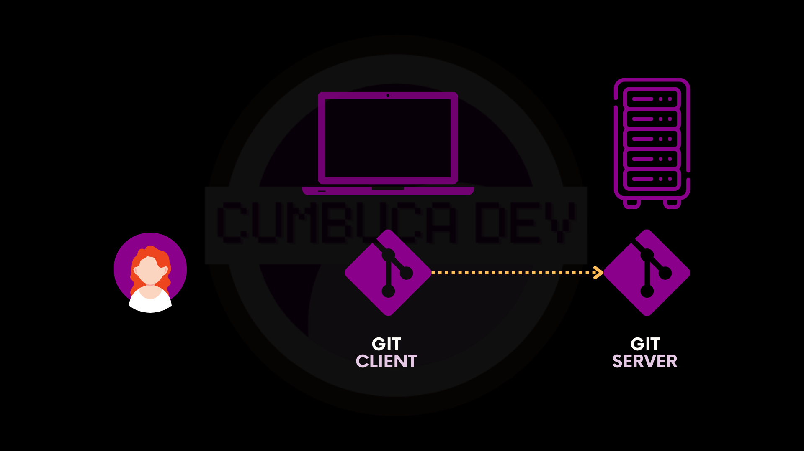
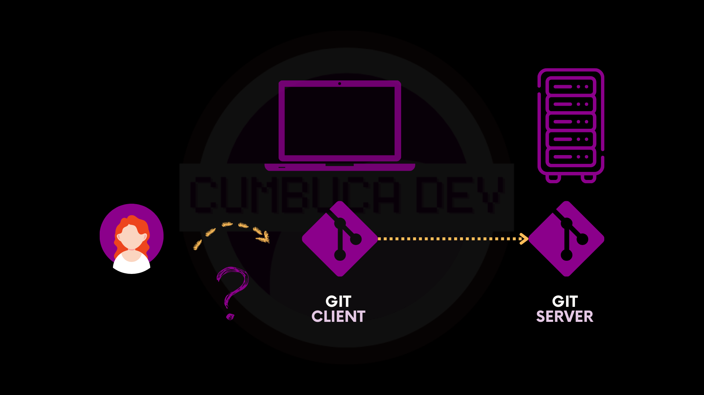
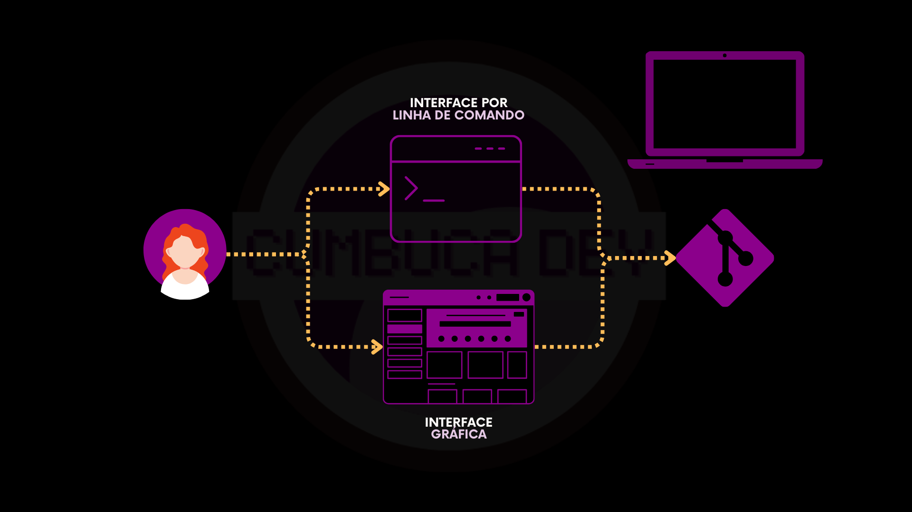

# 3.4 Interagindo com o Git

Depois de instalar o Git no seu computador, o próximo passo é aprender **como interagir com ele**. Git não é apenas um programa que “funciona sozinho”: ele precisa que você dê comandos para criar repositórios, salvar alterações e organizar seu código.

## Git Client e Git Server

Para entender como o Git funciona, é importante conhecer seus dois componentes principais:

* **Git Client**: é o Git que você instalou no seu computador. Ele registra alterações, organiza versões e permite enviar ou receber informações de repositórios.
* **Git Server**: é o Git instalado em um servidor, de forma a **guardar o repositório centralizado**. Ele permite que várias pessoas acessem o mesmo projeto, façam alterações e mantenham o histórico do código seguro e atualizado, mesmo usando computadores diferentes.

A ideia de “cliente” e “servidor” vem da forma como eles interagem: o seu computador atua como cliente, solicitando e enviando informações, enquanto o repositório central funciona como servidor, recebendo essas alterações e disponibilizando o projeto para todos os clientes conectados.

É importante notar que o Git Server **não é um software diferente do Git**. É o mesmo Git do client, apenas configurado para funcionar como repositório central, permitindo que clientes enviem alterações e recebam atualizações.

O Git Client e o Git Server trabalham juntos para que você possa salvar versões do seu projeto localmente e sincronizá-las com o repositório central, garantindo segurança, histórico completo de alterações e colaboração entre equipes.

<figure><figcaption></figcaption></figure>

## Duas formas de interagir com o Git Client

Mas, afinal, como acontece essa interação com o Git no dia a dia?

<figure><figcaption></figcaption></figure>

Existem duas maneiras principais de usar o Git Client:

1. **GUI (Interface Gráfica)**: permite interagir com o Git por meio de botões e menus, como em um aplicativo tradicional. Essa opção é mais visual e pode ser mais fácil para quem está começando.
2. **CLI (Linha de Comando)**: permite digitar comandos diretamente no terminal ou prompt de comando. Embora seja menos “bonito visualmente”, oferece **mais controle, flexibilidade e compreensão profunda do funcionamento do Git**.

<figure><figcaption></figcaption></figure>

## Por que vamos usar a CLI

Embora existam GUIs que facilitam a interação com o Git, neste curso vamos focar na linha de comando (CLI). Isso porque aprender a CLI permite entender exatamente o que o Git está fazendo, além de oferecer mais controle e flexibilidade sobre os projetos.

Neste curso, vamos usar o cliente oficial do Gi&#x74;**: a Git CLI**. Os motivos são:

* **É a solução oficial**: oferece todos os comandos do Git. Muitas interfaces gráficas (GUIs) implementam apenas um subconjunto, para simplificar.
* **Flexibilidade**: quem domina a CLI consegue migrar facilmente para qualquer GUI. O caminho inverso nem sempre funciona.
* **Compatibilidade com documentação**: quase toda documentação, tutoriais e suporte assumem o uso da CLI, o que facilita pesquisar e resolver problemas.
* **Funciona em qualquer ambiente**: você pode usar a CLI até em servidores e sistemas de integração contínua (CI), sem depender de telas ou menus visuais.

<figure><figcaption></figcaption></figure>

Pense na CLI como uma conversa com o Git. Em vez de clicar em botões, você escreve frases curtas no terminal dizendo o que quer que ele faça, e o Git responde executando aquela ação. Você interage digitando comandos diretamente no terminal ou prompt de comando. Alguns exemplos comuns são: `git --version`, `git init` e `git --help`.

<figure><figcaption></figcaption></figure>

Se você preferir usar uma GUI, está tudo bem! Ela pode tornar algumas tarefas mais visuais e intuitivas. Aqui você encontra uma lista de opções populares que você pode explorar:



***

Agora que você já entende como funciona a interação com o Git e por que utilizaremos a linha de comando neste curso, o próximo passo é conhecer o comando `git`, que é a base de todas as interações com a ferramenta.
