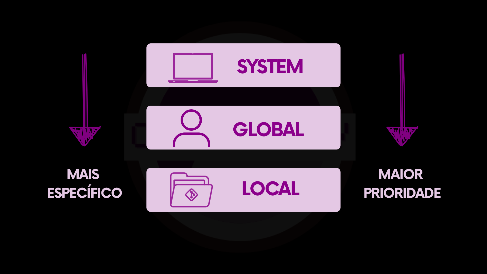
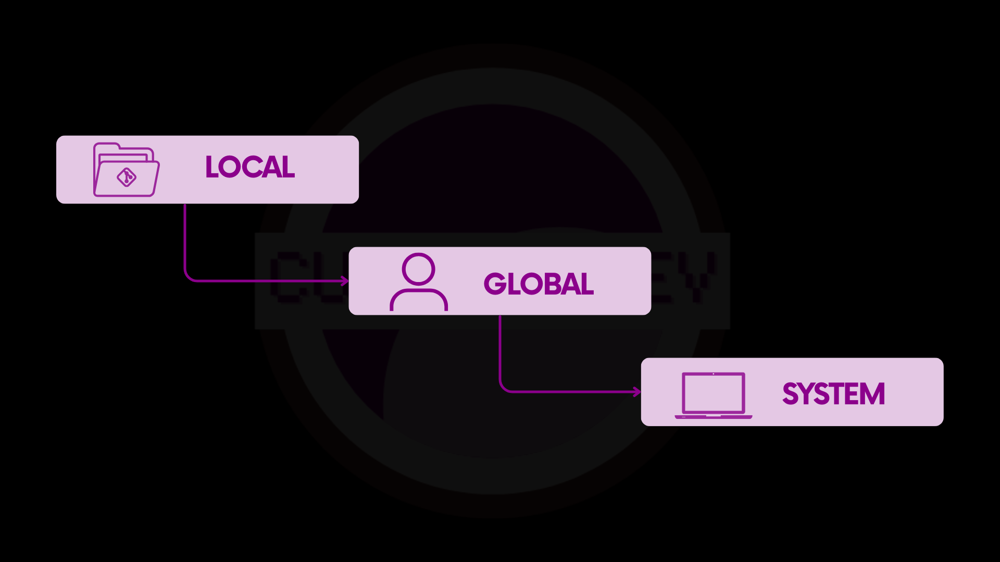

# 4.4.1 Escopos de configuração

Antes de aprender a criar ou alterar configurações, é importante entender **onde** o _Git_ guarda essas informações e **até onde** cada configuração vale.

Configurar o _Git_ é parecido com ajustar preferências em um aplicativo. Algumas opções são gerais e afetam todo o computador, outras dizem respeito apenas à pessoa que está usando o _Git_, e outras ainda valem somente para um projeto específico. No _Git_, essas diferenças são organizadas por meio de **escopos de configuração**. Um escopo define **quem é afetado** por uma configuração e **em quais projetos** ela se aplica.

### A ideia por trás dos escopos

Quando o _Git_ precisa de uma informação de configuração, ele não olha para um único lugar. Ele verifica **vários níveis**, do mais específico para o mais geral, até encontrar um valor que possa usar.

Esses níveis são os escopos de configuração. Cada escopo representa um contexto diferente: o computador, a pessoa usuária ou um projeto específico. Nem todos esses contextos existem o tempo todo, e entender isso é essencial para compreender o comportamento do _Git_.

O _Git_ possui três escopos principais: _system_, _global_ e _local_.

### Escopo de sistema (_system_)

O escopo de sistema pode ser comparado às configurações do console ou do computador onde os jogos rodam. São preferências que afetam tudo, independentemente de quem está usando. Em um jogo, seriam opções como a resolução da tela ou o idioma do console.

No _Git_, o escopo _system_ define configurações que se aplicam a todas as pessoas usuárias e a todos os repositórios do computador. Esse escopo **existe sempre**, enquanto o _Git_ estiver instalado na máquina, pois ele não depende de um projeto ou de uma pessoa específica.

Essas configurações ficam armazenadas em um arquivo de configuração do sistema, que o _Git_ lê sempre que é executado. Em sistemas Linux, esse arquivo costuma ficar em `/etc/gitconfig`. No Windows, ele normalmente fica dentro do diretório de instalação do _Git_, em um caminho como `C:\Program Files\Git\etc\gitconfig`.

No macOS, quando o _Git_ é instalado por meio do _Homebrew_, que é o método adotado neste livro, esse arquivo costuma aparecer em `/opt/homebrew/etc/gitconfig`. Isso acontece porque o _Homebrew_ instala e gerencia ferramentas em diretórios próprios, separados dos diretórios padrão do sistema operacional.

Você não precisa decorar esses caminhos. Eles aparecem aqui apenas para mostrar que esse escopo realmente existe e que suas configurações ficam em um arquivo separado.

Esse tipo de configuração normalmente é definido por quem administra o computador e não costuma ser alterado com frequência no uso diário.

### Escopo global (_global_)

O escopo _global_ pode ser comparado às preferências da pessoa jogadora em um jogo, como o nome do perfil ou o idioma. São configurações pessoais, que se repetem independentemente do projeto.

No _Git_, o escopo _global_ define configurações que se aplicam a todos os repositórios de uma mesma pessoa usuária, mas apenas no seu ambiente. Diferente do escopo _local_, o escopo _global_ **sempre existe para a pessoa usuária**, independentemente de você estar ou não dentro de um repositório _Git_.

Essas configurações ficam armazenadas em um arquivo localizado no diretório pessoal da pessoa usuária, geralmente chamado `.gitconfig`.

Esse é o escopo mais comum para configurações pessoais, pois normalmente elas não mudam de um projeto para outro.

### Escopo local (_local_)

O escopo _local_ pode ser comparado às configurações salvas de um jogo específico, como a dificuldade escolhida para uma partida em andamento.

No _Git_, o escopo _local_ define configurações que se aplicam somente ao repositório atual. Diferente dos outros escopos, o escopo _local_ **só existe quando você está dentro de um repositório&#x20;**_**Git**_. Fora de um repositório, não há escopo _local_ para o _Git_ consultar.

As configurações desse escopo ficam armazenadas dentro da própria pasta do projeto, no diretório oculto `.git`, em um arquivo de configuração exclusivo daquele repositório chamado `config`.

Isso permite que um projeto tenha comportamentos diferentes sem afetar outros projetos no mesmo computador.

### Resumo dos escopos

<table data-header-hidden data-full-width="true"><thead><tr><th></th><th></th><th></th><th></th><th></th></tr></thead><tbody><tr><td>Escopo</td><td>Quando existe</td><td>Para quem vale</td><td>Analogia com jogos</td><td>Onde o <em>Git</em> armazena</td></tr><tr><td><em>system</em></td><td>Sempre, enquanto o <em>Git</em> estiver instalado</td><td>Todas as pessoas usuárias do computador</td><td>Configurações do console ou do computador</td><td><code>/etc/gitconfig</code> ou <code>/opt/homebrew/etc/gitconfig</code> no macOS com <em>Homebrew</em></td></tr><tr><td><em>global</em></td><td>Sempre, enquanto o <em>Git</em> estiver instalado</td><td>Todos os projetos dessa pessoa</td><td>Perfil da pessoa jogadora</td><td><code>~/.gitconfig</code></td></tr><tr><td><em>local</em></td><td>Apenas dentro de um repositório <em>Git</em></td><td>Um projeto específico</td><td>Configurações de um jogo ou partida específica</td><td><code>.git/config</code></td></tr></tbody></table>

Esses arquivos são apresentados aqui apenas para ajudar a entender **como o&#x20;**_**Git**_**&#x20;organiza suas configurações internamente**. Apesar disso, não é recomendado editá-los manualmente. O gerenciamento das configurações deve ser feito por meio da linha de comando, que será apresentada na próxima seção.

### Ordem de prioridade dos escopos

Agora que você já sabe **quando cada escopo existe**, fica mais fácil entender como o _Git_ decide qual configuração utilizar.

A regra central é a seguinte:

> **O&#x20;**_**Git**_**&#x20;sempre utiliza a configuração mais específica disponível no contexto atual**.

Os escopos possuem níveis diferentes de especificidade. O escopo _system_ é o mais amplo e menos específico. O escopo _global_ é mais específico que o _system_. O escopo _local_ é o mais específico de todos.

<figure><figcaption></figcaption></figure>

Por isso, a ordem de prioridade entre eles é:

<figure><figcaption></figcaption></figure>

Essa ordem não muda. O que muda é **quais escopos estão disponíveis**, dependendo de onde o comando do _Git_ é executado.

#### Como o _Git_ lê as configurações

Sempre que o _Git_ precisa de uma configuração, ele segue um fluxo de leitura bem definido.

Quando você está **dentro de um repositório&#x20;**_**Git**_, o _Git_ faz o seguinte:

1. Primeiro, procura a configuração no escopo _local_ daquele repositório.
2. Se não encontrar, procura no escopo _global_ da pessoa usuária.
3. Se ainda assim não encontrar, utiliza o valor definido no escopo _system_.

Quando você está **fora de qualquer repositório&#x20;**_**Git**_, o escopo _local_ não existe. Nesse caso, o _Git_ começa a busca pelo escopo _global_. Se não encontrar a configuração ali, utiliza o valor definido no escopo _system_.

Em ambos os casos, assim que o _Git_ encontra um valor, a busca é encerrada. Os escopos mais amplos não são mais considerados.

#### Exemplos para fixar

**Exemplo 1**

Imagine que a configuração `user.name` esteja definida assim:

* _system_: `user.name = Maria Joaquinha Medeiros Santos`
* _global_: `user.name = Maria Santos`

Dentro de um repositório que **não possui configuração&#x20;**_**local**_, o _Git_ utilizará o valor do escopo _global_:

```
Maria Santos
```

Se, nesse mesmo computador, um repositório específico tiver a seguinte configuração _local_:

* _local_: `user.name = Maria`

Ao executar comandos dentro desse repositório, o _Git_ utilizará:

```
Maria
```

Fora de qualquer repositório _Git_, o escopo _local_ não é considerado, e o _Git_ utilizará novamente:

```
Maria Santos
```

**Exemplo 2**

Agora imagine que a configuração `user.email` esteja definida apenas nos escopos _system_ e _global_:

* _system_: `user.email = aprendiz.cumbucadev@gmail.com`
* _global_: `user.email = aprendiz@email.com`
* _local_: não definido

Nesse caso, tanto dentro quanto fora de um repositório, o _Git_ utilizará o valor do escopo _global_:

```
aprendiz@email.com
```

Isso acontece porque o escopo _global_ é o mais específico disponível.

**Exemplo 3**

Por fim, imagine uma configuração que exista apenas no escopo _system_:

* _system_: configuração definida
* _global_: não definida
* _local_: não definida

Nesse cenário, independentemente de você estar dentro ou fora de um repositório, o _Git_ utilizará o valor do escopo _system_, pois ele é o único disponível.

#### Resumo do fluxo

Sempre que o _Git_ precisa de uma configuração, o fluxo de leitura é o mesmo:

1. procura no escopo _local_, se existir
2. se não encontrar, procura no escopo _global_
3. se não encontrar, procura no escopo _system_

O _Git_ sempre utiliza o **primeiro valor encontrado**, que corresponde à configuração mais específica disponível no contexto atual.

Entender essa ordem de leitura ajuda a explicar por que uma configuração pode parecer não funcionar ou ser “ignorada”. Na maioria das vezes, ela está apenas sendo sobrescrita por outra definida em um escopo mais específico.

Na próxima seção, vamos aprender a usar o comando _git config_ na prática. Veremos como criar, alterar e consultar configurações do _Git_, aplicando conscientemente os escopos que vimos aqui para personalizar o comportamento da ferramenta de forma segura e controlada.

***

Na próxima seção, vamos aprender a usar o comando <mark style="color:purple;">git</mark> <mark style="color:orange;">config</mark> na prática. Veremos como criar, alterar e consultar configurações do Git, aplicando os escopos que vimos aqui para personalizar o comportamento da ferramenta de forma segura e controlada.
