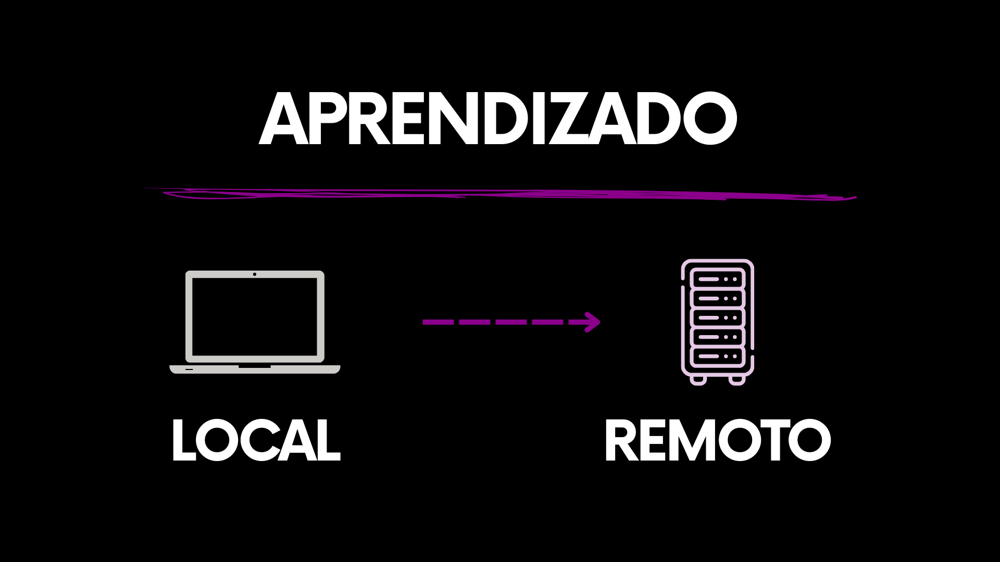

# 4.5 Explorando Operações Locais do Git

Desde o capítulo 3, nosso foco esteve exclusivamente no ambiente local. Essa escolha não é acidental e será mantida até o momento em que introduziremos o GitHub, mais adiante.

O Git é, em sua essência, uma ferramenta de uso local. A maior parte das operações acontece diretamente no seu computador, sem a necessidade de comunicação com servidores externos. Por isso, compreender bem esse contexto é um passo fundamental no aprendizado.

Ao trabalhar localmente, você desenvolve uma base sólida dos fundamentos do controle de versão, que sustentam todo o fluxo de trabalho com Git.

#### Git: trabalhando sem nternet

Uma das grandes vantagens do Git é sua independência de conexão. Isso é possível porque o Git é um **sistema de controle de versão distribuído (DVCS)**, no qual cada repositório contém uma cópia completa do histórico do projeto.

Na prática, isso permite registrar mudanças, navegar pelo histórico e gerenciar versões de forma totalmente local.

#### Por que usar Git localmente?

O trabalho no ambiente local não é apenas uma possibilidade, mas um elemento central no uso do Git. Independentemente de como um projeto se inicia, é no seu próprio computador que as alterações são criadas, registradas e organizadas.

Mesmo em fluxos que envolvem repositórios remotos, as operações fundamentais acontecem localmente. Esse modelo permite que o desenvolvimento ocorra de forma contínua, sem dependência direta de conexão com a internet ou de serviços externos.

Entre os principais benefícios desse modelo, destacam-se:

* **Trabalho Offline**: O desenvolvimento pode continuar mesmo sem conexão com a internet.
* **Desenvolvimento Inicial**: Projetos podem ser organizados e evoluídos sem a necessidade imediata de ambientes remotos.
* **Experimentação Segura**: O ambiente local oferece um espaço seguro para testar ideias e realizar ajustes antes de qualquer compartilhamento.

Mais do que uma etapa específica do fluxo, o ambiente local representa a base sobre a qual o Git opera.

#### Git pode funcionar completamente sem o GitHub

O Git opera de forma independente de plataformas remotas. Mesmo sem uma conta em serviços como GitHub, GitLab ou Bitbucket, é perfeitamente possível versionar código e manter o histórico de alterações.

Essas plataformas fornecem infraestrutura para **hospedagem de repositórios remotos** e colaboração, mas não são um requisito para o funcionamento do Git.

#### A importância de dominar o Git local antes do Git remoto

O trabalho com repositórios remotos baseia-se, fundamentalmente, na sincronização de alterações realizadas localmente. Assim, dificuldades comuns em cenários colaborativos geralmente estão relacionadas à compreensão insuficiente dos fundamentos do versionamento.

Consolidar essa base primeiro torna o aprendizado mais natural e reduz a complexidade quando novos elementos forem introduzidos.

<figure><figcaption></figcaption></figure>

***

Nos próximos capítulos, vamos aprofundar esses fundamentos exclusivamente no contexto do ambiente local. Todas as operações, exemplos e explicações considerarão apenas o repositório presente no seu próprio computador.

Essa distinção é importante, pois ainda não estamos tratando de repositórios remotos, sincronização ou colaboração em servidores externos. Esses conceitos serão introduzidos e explorados em detalhes mais adiante.
