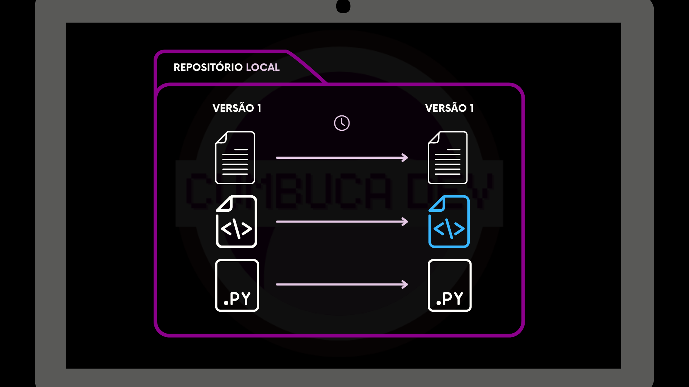
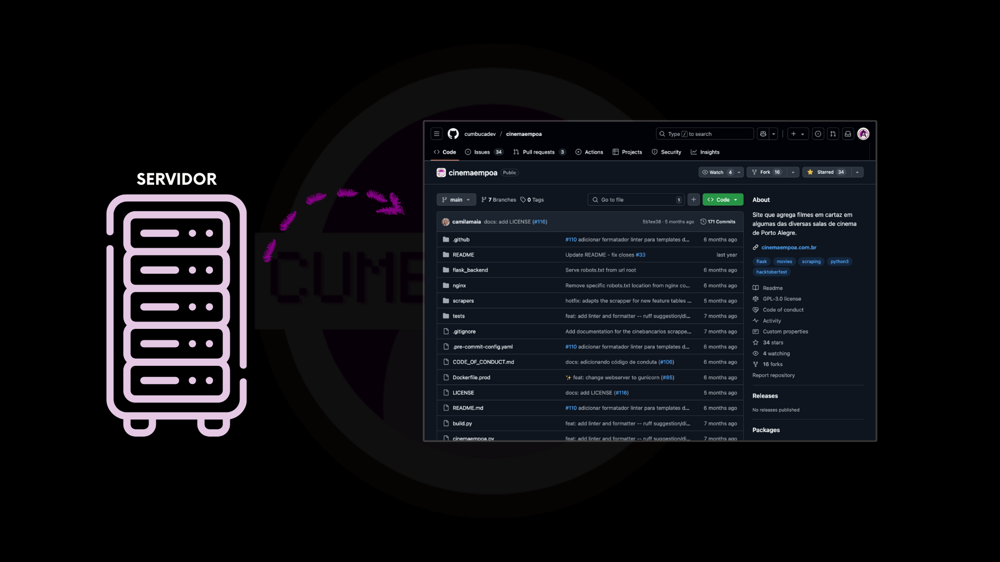

---
layout:
  width: default
  title:
    visible: true
  description:
    visible: false
  tableOfContents:
    visible: true
  outline:
    visible: true
  pagination:
    visible: true
  metadata:
    visible: true
---

# 4.2 O quê é um Repositório Git?

Um repositório, ou repo, é a principal unidade de armazenamento do Git. É nele que ficam todos os códigos, arquivos e o histórico completo de alterações de um projeto. Você pode pensar em um repositório como uma grande pasta que guarda não apenas os arquivos atuais, mas também todos os registros de mudanças e informações sobre como eles evoluíram ao longo do tempo.

Um repositório pode existir em dois lugares diferentes: localmente, no seu computador, ou remotamente, em um servidor.

### Onde um repositório pode existir

### Localmente

Um repositório **local** é aquele que fica no seu computador. Ele permite que você:

* Trabalhe em seus arquivos mesmo sem conexão com a internet;
* Salve alterações, criar histórico de mudanças e organizar o desenvolvimento;
* Testar e experimentar sem afetar outros colaboradores.

Pense nele como uma pasta privada, mas com superpoderes. Ela sabe tudo o que já aconteceu em cada arquivo do projeto.

<figure><figcaption></figcaption></figure>

## Remotamente

Um repositório **remoto** é aquele hospedado em um servidor, Ele permite que:

* Você compartilhe seu trabalho com outras pessoas;
* Múltiplos colaboradores trabalhem no mesmo projeto;

<figure><figcaption></figcaption></figure>

## Conexão entre reposiórios local e remoto

O repositório local e o remoto funcionam de forma conectada. Na prática:

* Você faz alterações no repositório local
* Depois, envia essas alterações para o repositório remoto
* Outras pessoas podem enviar alterações para o remoto, que você trará para o seu ambiente local

O repositório local funciona como sua área de trabalho pessoal, enquanto o remoto representa a versão central compartilhada do projeto. Eles se sincronizam para manter o histórico completo sempre atualizado.

Essa relação permite que você trabalhe de forma independente, sem deixar de colaborar com segurança com outras pessoas.

<figure><figcaption>
Um Repositório Remoto, no GitHub, tem essa aparência!
</figcaption></figure>


Na prática, para o Git, um repositório local e um repositório remoto são quase a mesma coisa. A principal diferença entre eles é apenas o local onde estão armazenados, no seu computador ou em um servidor.

Conceitos como apresentação do repositório, permissões de acesso, quem pode visualizar ou editar o código não fazem parte do Git em si. Esses controles são definidos pelas plataformas que hospedam os repositórios, como o GitHub. Vamos explorar esses conceitos mais adiante.


***

Agora que você já entende o que é um repositório e como ele pode existir localmente ou em um servidor, o próximo passo é aprender como criar o seu primeiro repositório. A seguir, vamos ver como inicializar um repositório Git e começar a versionar um projeto do zero.
