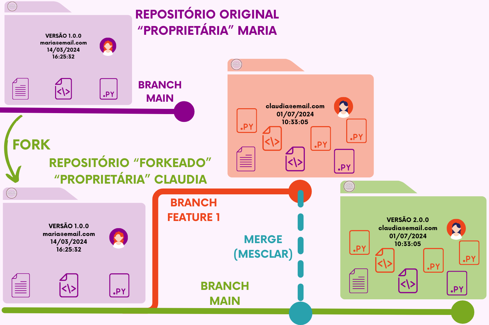
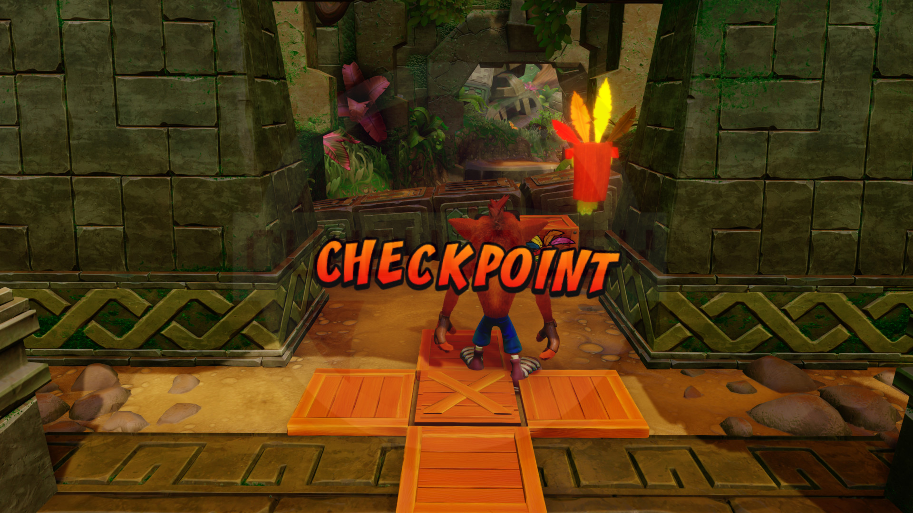
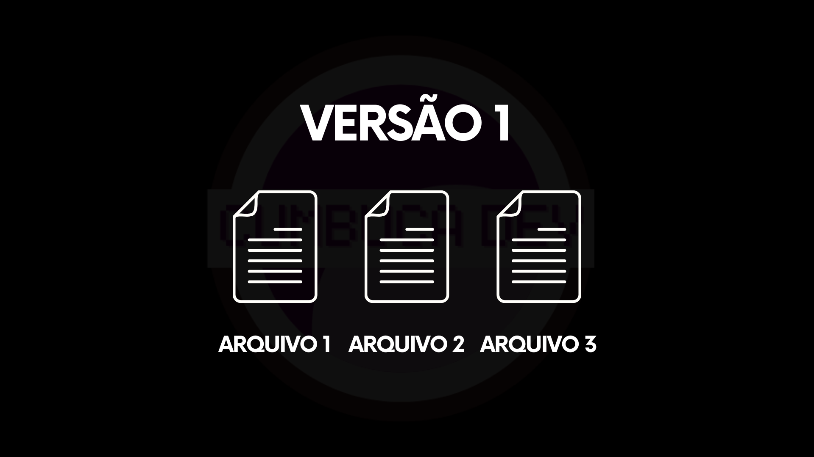
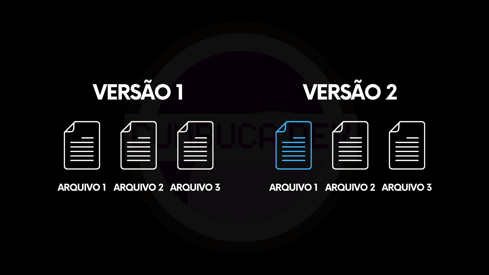

# 5.2 O quê significa "salvar" no Git?

Um dos conceitos mais importantes para compreender o Git é algo que já faz parte do nosso cotidiano: salvar. Antes de explorar comandos e fluxos, é útil ajustar a forma como entendemos essa ação aparentemente simples.

Salvar um projeto é tão rotineiro que raramente pensamos sobre o que realmente acontece. Alteramos arquivos, pressionamos um atalho e seguimos em frente, com a sensação de que apenas “guardamos” o trabalho.

Em ferramentas tradicionais, como editores de texto, salvar costuma aparecer em duas formas familiares: **Salvar** e **Salvar como**.

<figure><figcaption></figcaption></figure>

Quando utilizamos **Salvar**, atualizamos o arquivo existente. A versão anterior é substituída, e o documento passa a refletir o novo conteúdo. Já o **Salvar como** cria um novo arquivo, preservando o original e gerando uma segunda versão independente.

<figure><figcaption></figcaption></figure>

Esse modelo é tão natural que quase não o questionamos. Existe sempre um arquivo principal em um único estado. A cada salvamento, o passado é silenciosamente substituído pelo presente. Caso algo dê errado, dependemos de backups ou históricos automáticos.

No Git, porém, salvar assume outro significado. Salvar não é apenas atualizar um arquivo nem criar uma cópia isolada. Salvar é registrar um **estado completo** do projeto em um determinado momento. Em vez de substituir o que existia antes, o Git preserva um ponto no tempo.

Uma analogia útil é o conceito de **checkpoint** (ponto de controle) em jogos. Ao alcançar um checkpoint, o jogo grava seu progresso. Se você falhar depois disso, não precisa reiniciar tudo desde o começo. Você retorna exatamente àquele ponto salvo.

<figure><figcaption></figcaption></figure>

O aspecto mais interessante é que um checkpoint não salva apenas “o que mudou”. Ele preserva o **estado do jogo** naquele instante: posição, recursos, itens, ambiente. É como congelar o tempo e guardar aquela versão da experiência.

Isso permite experimentar. Você pode testar estratégias, assumir riscos, tentar caminhos diferentes. Se algo não funcionar, basta voltar ao checkpoint anterior.

No Git, o princípio é essencialmente o mesmo. Salvar significa criar um novo ponto de referência na história do projeto. Mesmo que apenas um arquivo tenha sido modificado, o que se registra é o **estado completo**.

Essa mudança de perspectiva é fundamental. O Git não funciona como um simples botão de salvar, mas como um sistema de checkpoints. Cada salvamento representa uma nova fotografia da evolução do trabalho.

Para visualizar essa ideia, imagine um projeto extremamente simples, composto por três arquivos.

<figure><figcaption></figcaption></figure>

Em um determinado momento, você salva o trabalho. Esse ponto passa a representar a versão 1, um retrato exato de como os três arquivos estavam naquele instante.

Agora imagine que você continua trabalhando e altera apenas o Arquivo 1.

Ao salvar novamente, o Git não registra apenas a modificação isolada. Ele cria um novo ponto no tempo. Surge a versão 2.

<figure><figcaption></figcaption></figure>

Ainda existem três arquivos, mas agora o conjunto reflete um estado ligeiramente diferente. A versão anterior continua preservada, intacta. A nova versão não substitui o passado; ela passa a coexistir com ele.

***

É desta forma que o Git constrói a história de um projeto. Cada salvamento não apaga, mas acrescenta. Cada estado não elimina, mas amplia. E é essa sequência que permite navegar pelo tempo, revisitar decisões e experimentar mudanças com segurança. Mas para que isso aconteça, o Git não lida diretamente apenas com “arquivos salvos”. Ele organiza as mudanças em diferentes áreas, cada uma com um papel específico no processo.

Para entender melhor como o Git transforma alterações em novos estados do projeto, precisamos primeiro compreender essas áreas. É isso que veremos na próxima seção.
