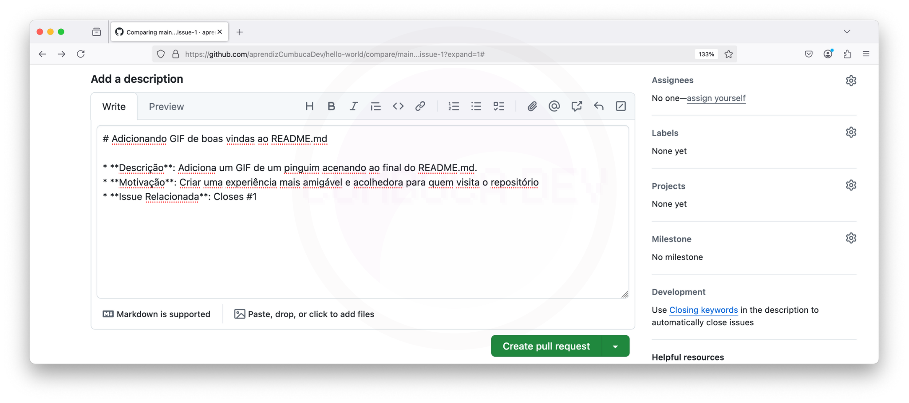

# 5.2 Salvando Alterações Localmente

## O quê significa "salvar" no Git?

Quando você trabalha com Git, a função "salvar" funciona de uma maneira um pouco diferente do que estamos acostumados em programas como editores de texto (como Microsoft Word, Google Docs...).

Normalmente, quando salvamos um documento em um editor de texto, estamos apenas atualizando o arquivo com as mudanças feitas. Esse processo é simples e direto: ou você está criando um arquivo novo (geralmente disponível no menu "Salvar Como") ou substituindo o arquivo existente com novas alterações (geralmente disponível no menu "Salvar").

<figure><figcaption></figcaption></figure>

<figure><figcaption></figcaption></figure>

No Git, o termo "salvar", em geral, é chamado de "commit". Fazer um commit é como salvar um conjunto de mudanças em seus arquivos e pastas. Não estamos apenas substituindo um arquivo, mas sim registrando **todas** as alterações feitas em vários arquivos de uma vez. É como tirar uma "foto" do estado atual de todo o projeto.

Então, sempre que você ouvir "commit" no Git, pense nisso como um "salvar" mais poderoso e abrangente, que acompanha um grupo de arquivos e suas alterações, em vez de apenas um único arquivo.

<figure><figcaption>
<a href="https://git-scm.com/book/en/v2/Getting-Started-What-is-Git%3F">https://git-scm.com/book/en/v2/Getting-Started-What-is-Git%3F</a>
</figcaption></figure>
