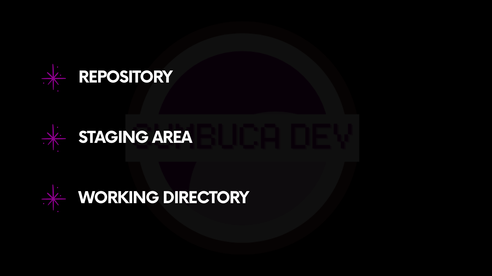
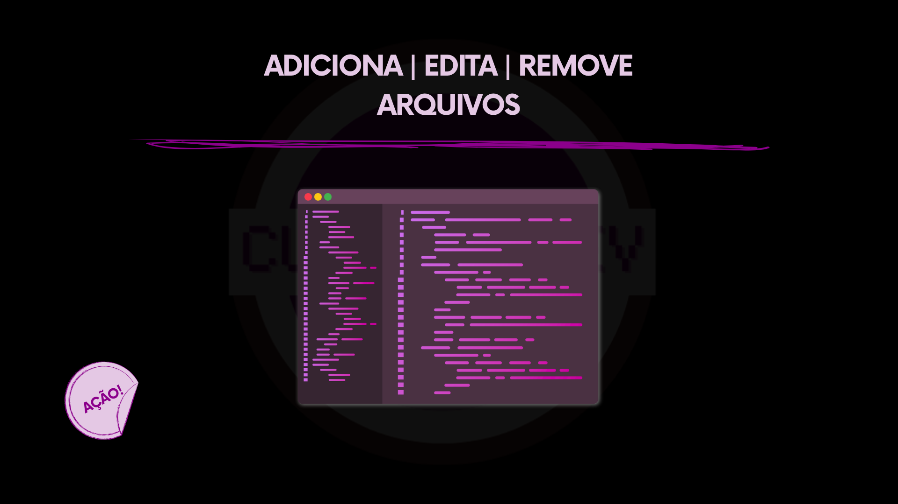
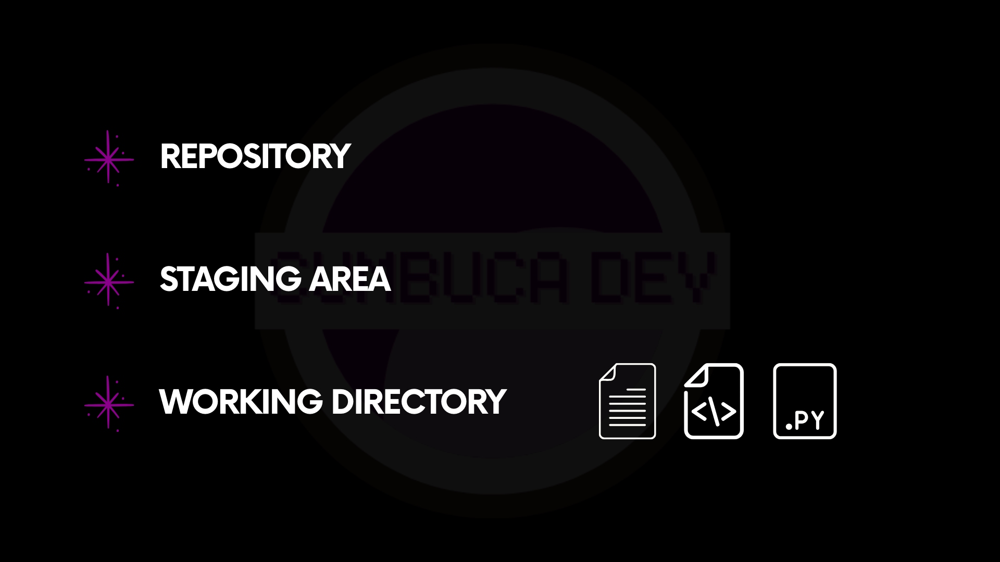
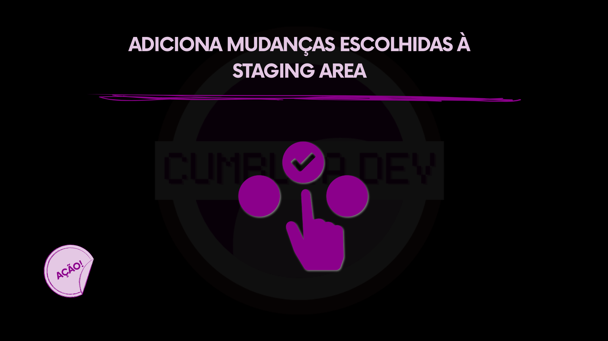
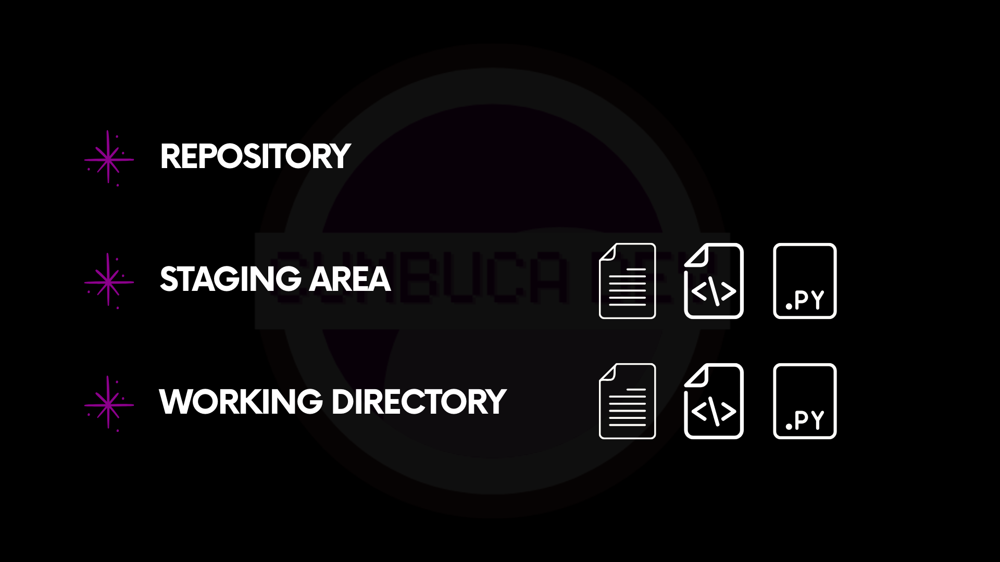
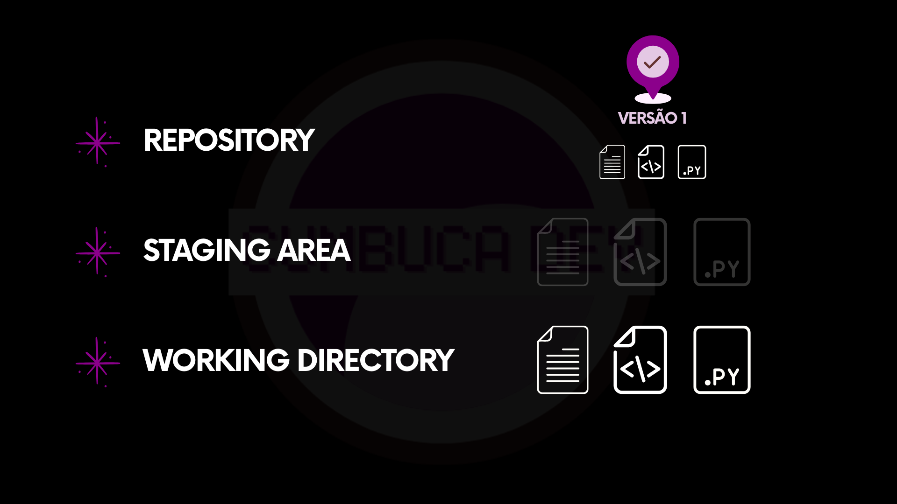
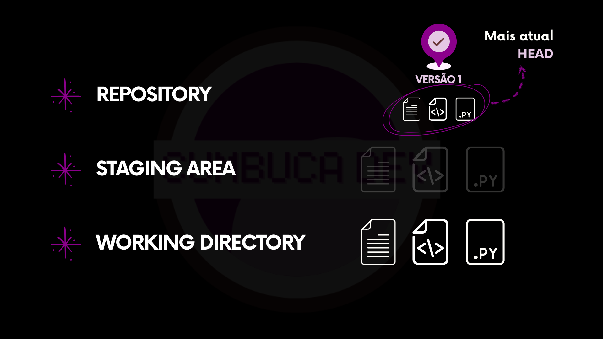
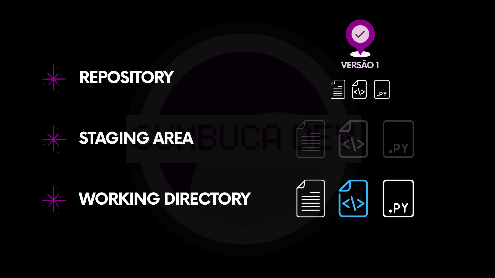
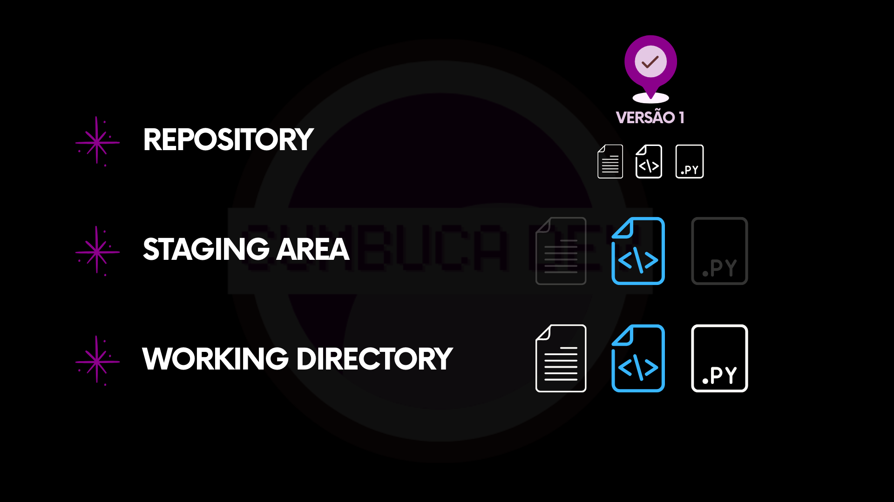
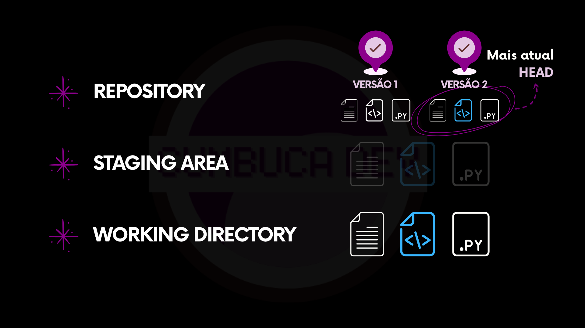

# 5.4.1 Exemplo 1

Este exemplo acompanha o fluxo de “salvar no Git” duas vezes. No primeiro ciclo, surgem três arquivos e uma primeira versão é registrada no repositório. No segundo, um arquivo é alterado e uma segunda versão é registrada.


Dá para pensar em **Working Directory → Staging Area → Repository** como um funil. Nem toda mudança vira uma nova versão. Só vira o que for colocado na **Staging Area**.




### Um repositório vazio

No início, não existe nenhum arquivo versionado. Existe apenas a pasta do projeto e o repositório inicializado.

<figure><figcaption>
Repositório vazio. Nenhuma mudança para salvar ainda.
</figcaption></figure>



### Três arquivos aparecem no projeto

Em seguida, três documentos são criados no projeto. Esses arquivos existem no computador, mas ainda não foram preparados para entrar no histórico.

<figure><figcaption>
Três arquivos foram criados no projeto.
</figcaption></figure>



### As mudanças ficam no Working Directory

Nesse momento, as mudanças estão no **Working Directory**. O Git enxerga esses arquivos como alterações locais.

<figure><figcaption>
As alterações aparecem como mudanças no Working Directory.
</figcaption></figure>



### As mudanças escolhidas vão para a Staging Area

Nesse ponto, as três adições são selecionadas para fazer parte da próxima versão. Elas são colocadas na **Staging Area**.

<figure><figcaption>
Selecionando arquivos para preparar as mudanças.
</figcaption></figure>

Depois disso, as mudanças selecionadas passam para a **Staging Area**.

<figure><figcaption>
Os três arquivos estão na Staging Area.
</figcaption></figure>



### Uma primeira versão é registrada no repositório (Repository)

Com as mudanças preparadas, acontece o salvamento. No Git, esse salvamento registra um novo ponto no histórico do projeto.

<figure><figcaption>
Registrando a versão formada pelas mudanças da Staging Area.
</figcaption></figure>

Após o salvamento, existe uma primeira versão registrada no repositório.

<figure><figcaption>
Versão 1 registrada. Ela passa a fazer parte do histórico.
</figcaption></figure>



### HEAD aponta para a versão atual

**HEAD** é um marcador. Ele aponta para a versão que está “em uso” no momento.

Como só existe uma versão registrada, a versão 1 é a HEAD.

<figure><figcaption>
HEAD aponta para a versão mais recente (no momento, a 1).
</figcaption></figure>



### Uma nova alteração acontece no projeto

O trabalho continua. Ou seja: arquivos são editados no Working Directory.

<figure><figcaption>
Trabalho retomado após a versão 1 ter sido registrada.
</figcaption></figure>

Agora, um dos arquivos é modificado.

<figure><figcaption>
Um arquivo foi editado. Existe uma mudança local.
</figcaption></figure>



### A alteração escolhida é preparada

A alteração que deve entrar na próxima versão é selecionada.

<figure><figcaption>
Selecionando a mudança que vai para a Staging Area.
</figcaption></figure>

Depois disso, a alteração passa a estar na staging area.

<figure><figcaption>
A mudança editada está na Staging Area.
</figcaption></figure>



### Uma segunda versão é registrada e a HEAD avança

A mudança preparada é registrada. Isso cria uma nova versão do projeto.

<figure><figcaption>
Registrando a segunda versão.
</figcaption></figure>

Agora existe a versão 2. E a **HEAD** passa a apontar para ela.

<figure><figcaption>
Versão 2 registrada. HEAD aponta para a versão mais recente.
</figcaption></figure>



***

O que podemos levar deste exemplo é a compreensão do caminho que as mudanças percorrem dentro do Git. As alterações surgem no **Working Directory**, passam pela **Staging Area**, onde são organizadas, e somente então são registradas no **Repository**. Nesse contexto, a **HEAD** indica qual é o estado atual do projeto.

Na sequência, veremos um novo exemplo que evidencia por que a staging area é uma das peças mais importantes desse fluxo.
