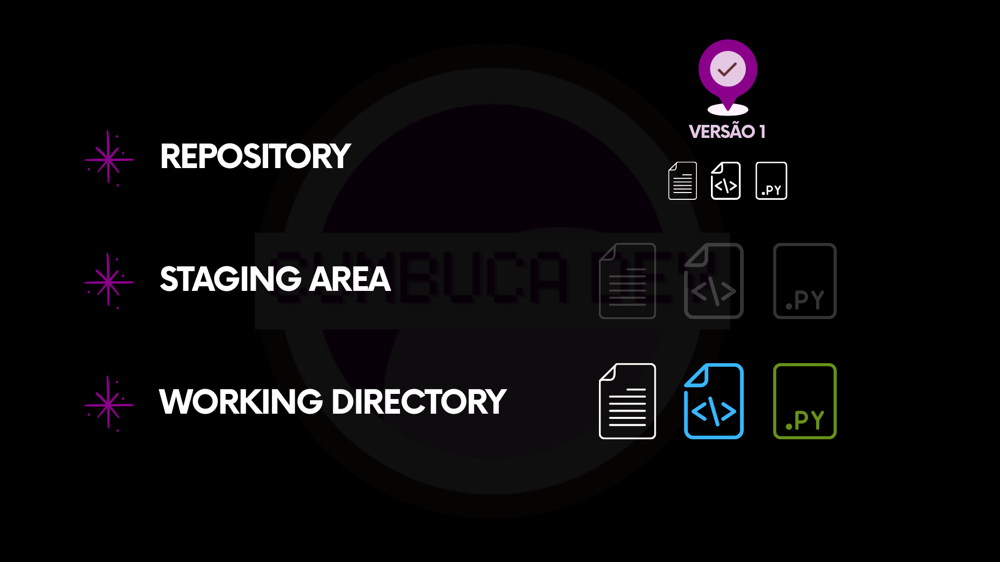
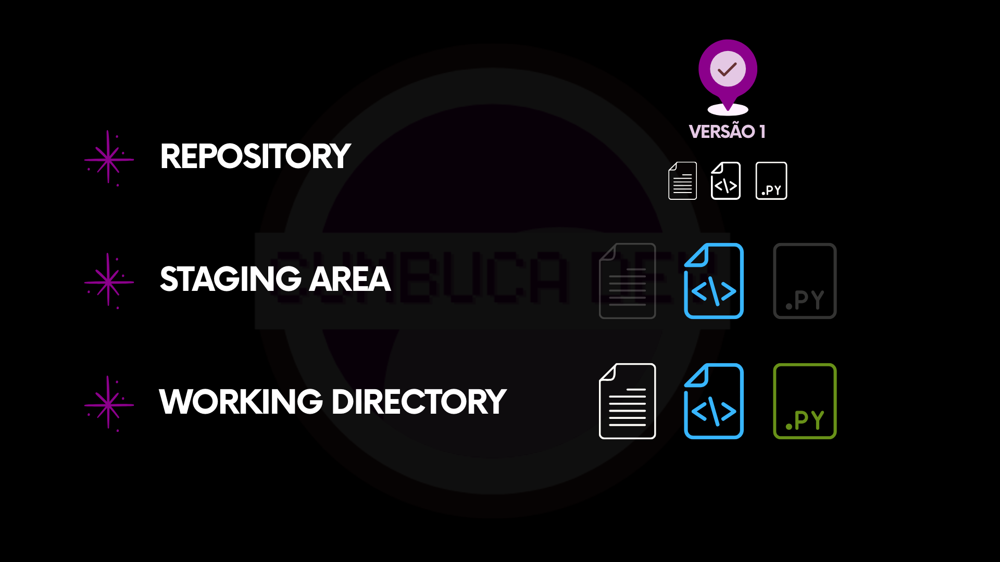
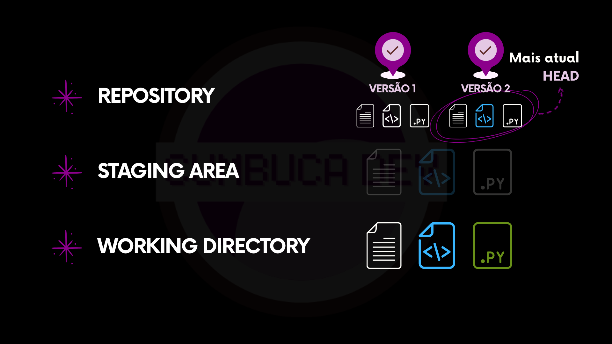

# 5.4.2 Exemplo 2

Este exemplo ajuda a compreender o papel da **Staging Area**. É ela que permite separar mudanças em versões menores e decidir exatamente o que será registrado.


A Staging Area funciona como uma “lista do que entra na próxima versão”. O que fica fora não entra no histórico ainda.




### O projeto já tem uma versão registrada

O cenário começa com um repositório com três arquivos. Essa versão já está guardada no **Repository**.

<figure><figcaption>
Uma versão anterior já existe no histórico.
</figcaption></figure>



### Duas alterações acontecem no Working Directory

Em um momento de trabalho, dois arquivos são editados. Essas mudanças aparecem no **Working Directory**.

<figure><figcaption>
Dois arquivos passam a ter alterações locais.
</figcaption></figure>

O Git passa a mostrar duas modificações pendentes.

<figure><figcaption>
Duas alterações no Working Directory.
</figcaption></figure>



### Apenas uma alteração é preparada

Em vez de registrar tudo junto, só uma alteração é escolhida. Ela é colocada na **Staging Area**.

<figure><figcaption>
Uma das mudanças é selecionada para a Staging Area.
</figcaption></figure>

A outra alteração permanece no Working Directory. Ela ainda não foi preparada.

<figure><figcaption>
Somente uma mudança está preparada. A outra ainda está fora.
</figcaption></figure>



### O salvamento registra só o que estava preparado

O salvamento acontece a partir da Staging Area. Ele registra uma nova versão no **Repository**.

<figure><figcaption>
Registrando a nova versão com base na Staging Area.
</figcaption></figure>

O resultado é uma nova versão no histórico. Ela não inclui tudo o que estava no Working Directory.

<figure><figcaption>
Nova versão registrada. Apenas a mudança preparada entrou no histórico.
</figcaption></figure>



## O papel da Staging Area

O exemplo recém visto destaca a função central da **Staging Area** no fluxo do Git. Sua principal vantagem é o controle. Em vez de registrar todas as alterações de uma vez, é possível organizar as mudanças de forma intencional, construindo versões mais claras e coerentes.

Na prática, isso permite agrupar alterações relacionadas, evitar que modificações indesejadas entrem no histórico e manter uma progressão mais organizada do projeto. O resultado é uma história mais legível, que facilita entendimento e revisão.

Essa flexibilidade também é útil em situações comuns do dia a dia. Um projeto pode acumular várias mudanças ao mesmo tempo, mas nem todas representam um estado pronto para ser preservado. A staging area permite separar apenas o que faz sentido registrar naquele momento.

Da mesma forma, caso parte das alterações ainda precise de ajustes, basta deixá-las no **Working Directory**, sem incluí-las na preparação.

Mais do que um detalhe técnico, a **Staging Area** é um mecanismo de organização. Ela transforma o ato de salvar em uma atividade consciente, permitindo que cada novo estado do projeto represente exatamente o que se deseja registrar.

***

Para que o processo de registro de mudanças funcione corretamente, o Git precisa primeiro reconhecer os arquivos e suas alterações. Nem todo arquivo presente no working directory é automaticamente acompanhado pelo sistema. Na próxima seção, veremos como esse mecanismo funciona e por que ele é essencial no dia a dia.
