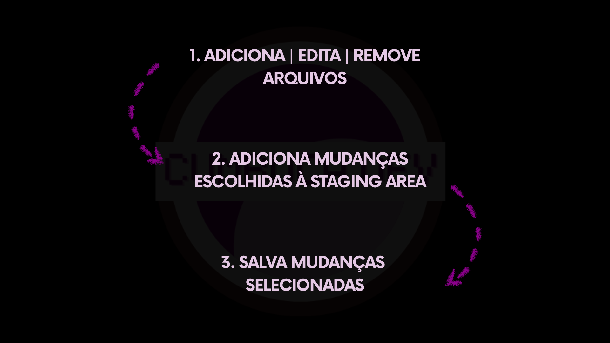

# 5.4 Como salvar no Git

Agora que entendemos as áreas locais do Git, podemos observar como o processo de salvar acontece na prática. Diferentemente de um simples botão de “Salvar”, o Git utiliza um pequeno fluxo que transforma alterações em um novo estado preservado do projeto.

Esse processo pode ser compreendido em três etapas.

### 1. Adição, edição ou remoção de arquivos

Tudo começa no momento em que você trabalha nos arquivos do projeto. Criar novos arquivos, modificar conteúdos existentes ou remover elementos que não são mais necessários são ações naturais do desenvolvimento.

Todas essas alterações surgem no **Working Directory**. Nesse estágio, as mudanças existem apenas como edições locais. Elas ainda não fazem parte de um estado preservado.

### 2. Adicionando mudanças à Staging Area

Depois de realizar alterações, o próximo passo é decidir o que fará parte do novo estado do projeto.

O Git permite que você selecione quais mudanças deseja preparar. Em vez de registrar automaticamente tudo o que foi modificado, você adiciona apenas as alterações escolhidas à **Staging Area**.

Essa etapa representa um momento de organização. Você define, de forma intencional, quais modificações compõem a próxima versão.

### 3. Salvando as mudanças selecionadas

Com as mudanças organizadas, chega o momento de registrá-las.

Ao salvar, o Git preserva o estado construído a partir das alterações que estavam na staging area. Esse novo estado passa a integrar o **Repository**, tornando-se parte da história do projeto.

As mudanças deixam de ser apenas edições em andamento e passam a representar um ponto no tempo.

***

Em resumo, o processo de salvar no Git pode ser entendido de forma direta como:

1. Você adiciona, edita ou remove arquivos
2. Você adiciona as mudanças escolhidas à **Staging Area**
3. Você salva as mudanças selecionadas

<figure><figcaption></figcaption></figure>

O funcionamento desse fluxo pode ser compreendido com mais clareza quando o observamos em situações concretas. A seguir, veremos dois exemplos que ajudarão a visualizar como esse processo ocorre na prática.
