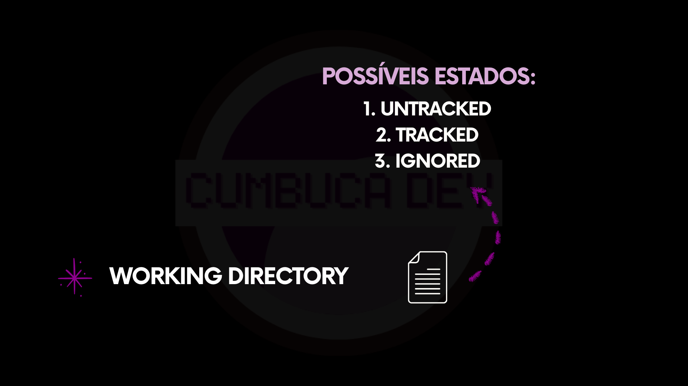

# 5.5 Rastreamento de um arquivo

Ao trabalhar com Git, é essencial compreender uma ideia que nem sempre é evidente à primeira vista: **nem tudo o que está no diretório de trabalho está sendo versionado**.

Embora todos os arquivos estejam visíveis na sua máquina, o Git não assume automaticamente que deve acompanhar cada um deles. Existe uma decisão envolvida nesse processo. Você define quais arquivos farão parte do controle de versão e quais permanecerão fora dele. Em outras palavras, o Git não cuida de arquivos por padrão. Ele espera que você indique o que deve ou não ser acompanhado.

Dentro desse modelo, todo arquivo presente no **Working Directory** estará sempre em um de três estados possíveis: **untracked** (não rastreado), **tracked** (rastreado) ou **ignored** (ignorado). Esses estados não descrevem o conteúdo do arquivo, mas sim como o Git o enxerga dentro do sistema.

<figure><figcaption></figcaption></figure>

## Untracked (não rastreado)

Um arquivo **untracked**, ou não rastreado, existe no diretório de trabalho, mas ainda está fora do controle de versão. O Git reconhece que o arquivo está ali, porém não acompanha suas modificações.

Todo arquivo novo começa nesse estado. Ao criar um arquivo, o Git não assume automaticamente que ele deve fazer parte da história do projeto. A decisão é sempre sua.

É como se o Git dissesse:

> _"Percebi que existe um arquivo novo aqui. Quer que eu comece a acompanhá-lo?"_

<figure><figcaption></figcaption></figure>

Uma analogia útil é imaginar uma loja de roupas. Quando uma nova camiseta chega à loja, ela pode estar fisicamente no ambiente, guardada em uma caixa ou recém-colocada em uma prateleira. Nesse momento, ela ainda não faz parte do sistema de controle de estoque.

<figure><figcaption></figcaption></figure>

Quem toma essa decisão é o vendedor. Ao perceber a nova peça, ele decide se aquela camiseta deve ser cadastrada no sistema ou não.

O arquivo untracked representa exatamente esse estágio: algo que existe no ambiente, mas ainda não foi integrado ao sistema de controle.

## Tracked (rastreado)

Um arquivo **tracked**, ou rastreado, já está sob o controle de versão. Nesse estado, o Git passa a observar qualquer modificação realizada nele.

Agora, o Git não apenas reconhece a existência do arquivo, mas acompanha sua evolução ao longo do tempo.

É como se o Git afirmasse:

> _"Esse arquivo faz parte do projeto. Estou acompanhando tudo o que muda."_

<figure><figcaption></figcaption></figure>

Retomando a analogia da loja, esse é o momento em que a camiseta foi cadastrada no sistema. A partir desse ponto, ela passa a ter registro, controle e histórico. O sistema sabe que ela existe e consegue acompanhar qualquer movimentação.

<figure><figcaption></figcaption></figure>

O mesmo acontece com o arquivo: ele continua sendo o mesmo, mas agora faz parte do controle.

## Ignored (ignorado)

Um arquivo **ignored**, ou ignorado, também existe no diretório de trabalho, mas foi **explicitamente marcado para ser desconsiderado**. Aqui existe uma decisão consciente: você informa ao Git que aquele arquivo não deve ser acompanhado.

Isso acontece porque o arquivo não faz sentido dentro do controle de versão. Pode ser um arquivo temporário, algo gerado automaticamente ou um elemento que pertence apenas ao ambiente local.

Para o Git, é como se ele se tornasse invisível. O sistema não rastreia, não monitora e não emite avisos sobre ele.

É como se o Git dissesse:

> _"Esse tipo de arquivo não faz parte do projeto. Vou ignorá-lo._

<figure><figcaption></figcaption></figure>

Na analogia da loja, pense novamente na camiseta do vendedor. Ela está dentro da loja, mas não pertence ao estoque. Não faria sentido cadastrá-la no sistema, pois ela não é um item de venda. O vendedor simplesmente a ignora e não a adiciona ao sistema.

O mesmo ocorre com arquivos ignorados: eles existem, mas estão fora do escopo do versionamento por decisão intencional.

## Uma decisão consciente

Esses três estados revelam uma característica central do Git: **versionamento é uma escolha, não um comportamento automático**.

Arquivos surgem como untracked. A partir daí, você decide se eles passarão a ser tracked ou se devem permanecer fora do controle. Em alguns casos, também pode ser desejável que determinados arquivos sejam ignorados.

Compreender essa dinâmica evita uma confusão bastante comum: acreditar que “estar na pasta” significa “estar sendo versionado”. No Git, presença não implica rastreamento. Rastreamento é sempre uma decisão.
