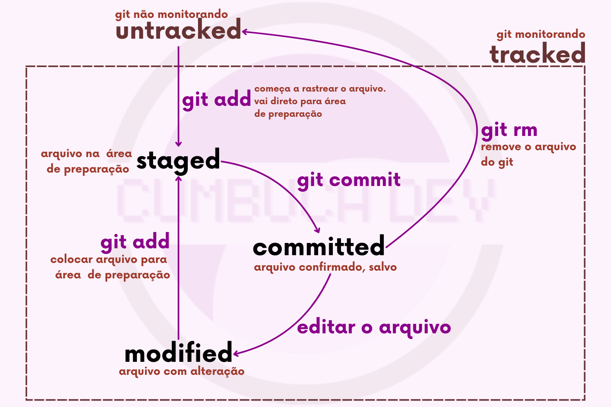

# 5.5 Rastreamento de um arquivo

## Rastrear um Arquivo

Os arquivos em sua pasta de trabalho podem estar sendo rastreados pelo Git ("_tracked"_) ou não ("_untracked"_):

* **Não rastreados (Untracked):** São arquivos que não estão sendo monitorados pelo Git. Eles existem no diretório de trabalho, mas nunca foram adicionados ao repositório Git. Ou seja, o Git simplesmente não controla o versionamento destes arquivos.
* **Rastreados (Tracked):** São arquivos que o Git conhece e está rastreando. Isso inclui arquivos que foram adicionados ao repositório e que fazem parte do histórico de commits.

Ao criar um arquivo novo no seu diretório local, ele ainda não estará sendo rastreado pelo Git. Para isso, você precisa explicitamente adicioná-lo com o comando <mark style="color:purple;">git</mark> <mark style="color:orange;">add</mark>. A partir de então, o Git passará a controlar o versionamento do novo arquivo no projeto.

## Estados de um Arquivo R**astreado**

No Git, os arquivos podem estar em diferentes estados para gerenciar as mudanças de forma mais eficiente, uma vez que "salvar" no Git é mais complexo do que em um editor de texto tradicional. Os estados permitem que você escolha quais mudanças salvar (commit) e quais não. Por exemplo, se você está trabalhando em duas funcionalidades diferentes no mesmo projeto, você pode selecionar quais arquivos ou partes de arquivos deseja incluir no commit de cada funcionalidade.

Portanto, uma vez que o arquivo está sendo rastreado pelo Git, ele pode estar em um dos seguintes estados:

* **Modificado (Modified)**: Quando você faz alterações em um arquivo no seu diretório de trabalho, ele está no estado modificado. Isso significa que você mudou o conteúdo do arquivo, mas ainda não informou ao Git que deseja salvar essas mudanças.
* **Preparado (Staged)**: Depois de modificar um arquivo, você pode usar o comando <mark style="color:purple;">git</mark> <mark style="color:orange;">add</mark> para colocar essas mudanças na área de preparação (staging area ou _index_). Quando um arquivo está na staging area, ele está no estado preparado. Isso significa que você está dizendo ao Git que essas mudanças devem ser incluídas no próximo commit.
* **Salvo / Confirmado (Committed)**: Quando você está satisfeito com as mudanças que preparou, você usa o comando <mark style="color:purple;">git</mark> <mark style="color:orange;">commit</mark> para salvar essas mudanças no repositório do Git. Um commit é como tirar uma "foto" do estado atual do seu projeto e armazená-la permanentemente no histórico do Git. Quando um arquivo está confirmado, suas mudanças estão salvas de forma segura no repositório.

A preparação seletiva oferece flexibilidade para testar e revisar antes de confirmar as mudanças. Você pode fazer várias alterações, mas só preparar aquelas que estão prontas para serem confirmadas. Isso ajuda a manter um histórico claro e organizado, pois cada commit representa uma "foto" do estado dos arquivos, facilitando a rastreabilidade e a colaboração.

Resumindo:

* **Modificado**: Arquivo foi alterado, mas as mudanças não foram preparadas.
* **Preparado (Staged)**: Mudanças estão na área de preparação e prontas para serem confirmadas.
* **Confirmado / Salvo (Committed)**: Mudanças foram salvas no repositório do Git.

## Possíveis Estados de um Arquivo no Git

<figure><figcaption>
Possíveis estados de um arquivo no git
</figcaption></figure>
