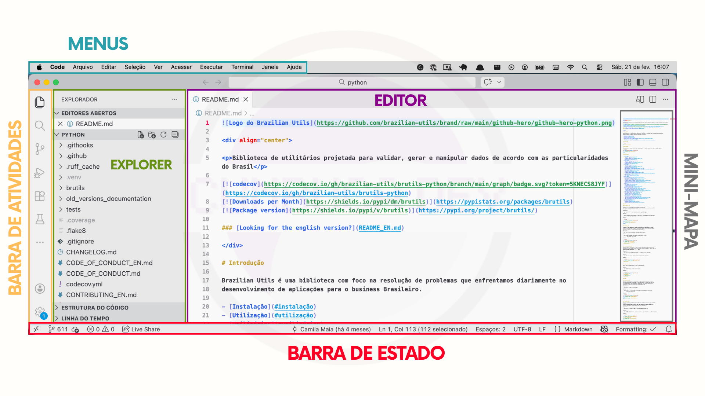

# 6.2.3 Conceitos do Visual Studio Code

Antes de começarmos a utilizar o Visual Studio Code na prática, é importante compreender alguns conceitos básicos sobre o ambiente. Mais do que um simples programa de edição, o VS Code funciona como um espaço de trabalho que organiza arquivos, pastas e diferentes áreas da interface em um único ambiente integrado. Neste momento, o objetivo não é memorizar nomes ou funcionalidades, mas construir familiaridade com a ferramenta e entender como ela estrutura o trabalho.

## Projetos

No Visual Studio Code, o trabalho acontece sempre a partir de **pastas**. Em vez de abrir arquivos isolados, o uso mais comum do editor é abrir uma pasta inteira, que representa o projeto. Ao fazer isso, todos os arquivos e subpastas passam a ser exibidos no ambiente, permitindo navegar pela estrutura, criar novos arquivos, modificar conteúdos e manter a organização de forma centralizada.&#x20;

Na prática, isso significa algo bastante simples: você quase sempre abrirá pastas, e não arquivos individuais. Essa abordagem ajuda a preservar uma visão mais clara do projeto e facilita a interação com múltiplos arquivos.

## Principais componentes

O Visual Studio Code é composto por diferentes áreas e painéis que trabalham juntos para organizar o ambiente de trabalho. Neste estágio, não é necessário memorizar todos os nomes. O mais importante é compreender **onde cada coisa acontece**.

<figure><figcaption>
Principais áreas da interface do VS Code
</figcaption></figure>

Na parte superior do editor encontra-se o **Menu Principal**. Ele reúne comandos e ações organizadas em categorias, permitindo acessar funcionalidades do editor por meio de uma navegação estruturada.

A **Barra de Atividades (Activity Bar)** é a coluna de ícones localizada na lateral do editor. Sua principal função é alternar o conteúdo exibido na barra lateral. Entre os ícones mais utilizados estão o **Explorer**, responsável pela navegação entre arquivos e pastas, o **Search**, voltado para buscas, e o **Source Control**, relacionado ao controle de versão.

O **Editor** é a área central do VS Code. É nela que o conteúdo dos arquivos é exibido e modificado. Sempre que um arquivo é aberto, ele aparece nessa região. Na parte superior do editor encontram-se as **abas (Tabs)**, que representam os arquivos abertos e permitem alternar entre eles de maneira fluida.

Na lateral do editor pode aparecer o **Mini-map**. Ele funciona como uma visualização compacta do arquivo aberto, facilitando a navegação por conteúdos mais extensos.

A **Barra de Status (Status Bar)**, localizada no rodapé, apresenta informações rápidas sobre o contexto atual.

O **Explorer** é um dos elementos mais importantes do Visual Studio Code. Ele apresenta a estrutura de arquivos e pastas do projeto, funcionando como uma representação visual do diretório de trabalho. Por meio dele, é possível navegar entre arquivos, abrir conteúdos, criar novos elementos e organizar a estrutura do projeto. No início, grande parte das interações acontecerá nesse painel.

***

Compreender esses componentes é o primeiro passo para se orientar dentro do Visual Studio Code. Mais do que memorizar nomes, o objetivo é reconhecer onde cada ação acontece e como o ambiente organiza o trabalho com arquivos. A seguir, veremos um exemplo prático que apresenta as interações básicas do editor e ajuda a desenvolver familiaridade com a manipulação de arquivos.
