# 6.2.4 Manipulando arquivos no Visual Studio Code

Agora que conhecemos os principais elementos da interface, é o momento de começar a interagir com o Visual Studio Code.

Nesta seção, exploraremos as ações mais básicas realizadas no editor. O objetivo não é aprender recursos avançados, mas desenvolver familiaridade com o ambiente e compreender como manipular arquivos dentro de um projeto.

Caso o editor ainda não esteja instalado em sua máquina, consulte a seção [Visual Studio Code](9.3.3.1-editor-de-codigo-1.md), onde apresentamos o processo de instalação.

A seguir, veremos um passo a passo que demonstra as interações fundamentais do VS Code.

## Passo a passo



### 1. Abrir o VS Code

<figure>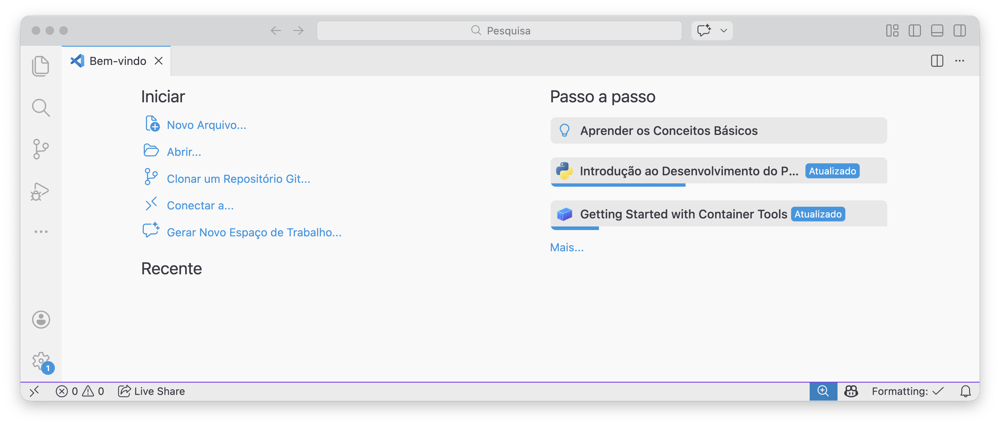<figcaption>
VS Code aberto
</figcaption></figure>



### 2. Fechar a aba de “Bem-vindo”

Ao abrir o VS Code, ele pode mostrar a aba **Bem-vindo**. Ela serve como um atalho para ações comuns, como **abrir uma pasta**, criar um arquivo, instalar extensões e ver atalhos. Como neste capítulo vamos trabalhar direto com o projeto, você pode fechá-la sem medo.

Clique no **X** da aba.

<figure>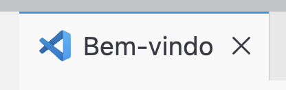<figcaption>
Fechando a aba “Bem-vindo”
</figcaption></figure>

O editor fica assim:

<figure>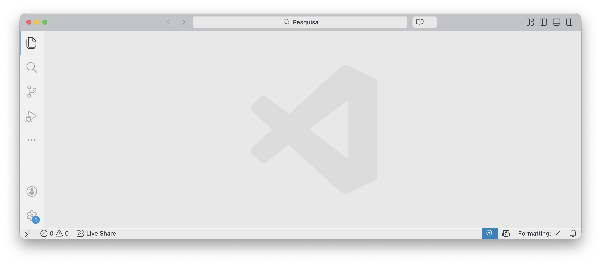<figcaption>
Editor sem a aba de boas-vindas
</figcaption></figure>


Se você quiser abrir essa aba novamente, use a Paleta de Comandos (`Ctrl + Shift + P` / `Command + Shift + P`) e procure por `Welcome`.




### 3. Abrir o Explorer (barra lateral)

Clique no ícone de **arquivos/documentos** (Explorer).

<figure>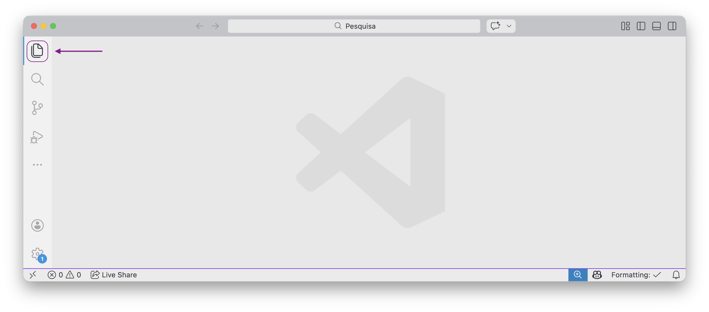<figcaption>
Abrindo o Explorer
</figcaption></figure>

Você verá a barra lateral:

<figure>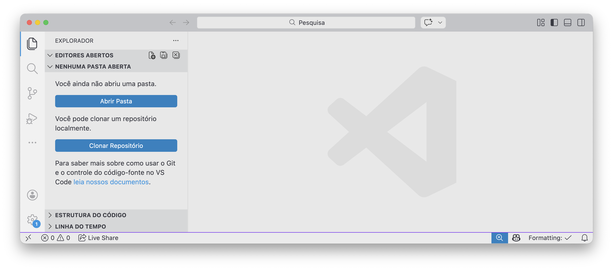<figcaption>
Explorer aberto
</figcaption></figure>



### 4. Clicar em “Abrir Pasta...”

Clique em **Abrir Pasta**.

<figure>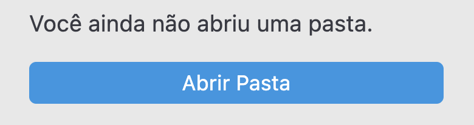<figcaption>
Botão “Abrir Pasta”
</figcaption></figure>


Uma pasta aberta no VS Code é o seu “projeto”.




### 5. Criar a pasta `meu-projeto`

Na janela de seleção, clique em **Nova pasta**.

<figure>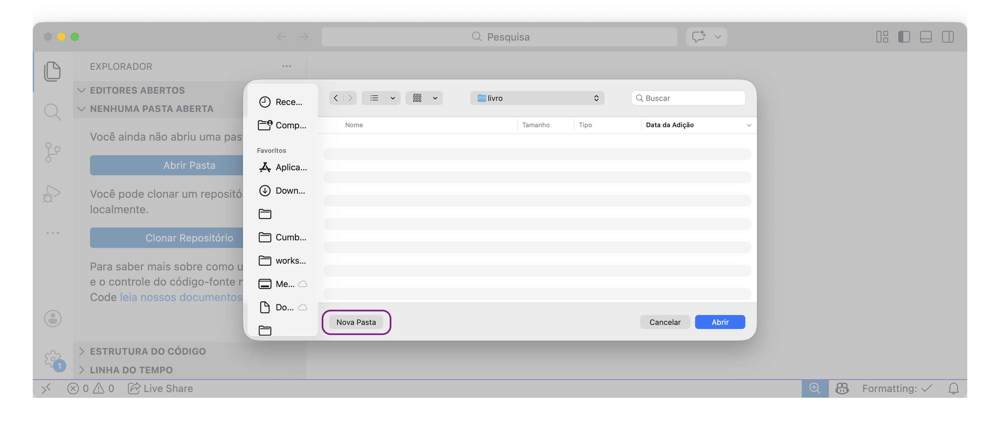<figcaption>
Criando nova pasta
</figcaption></figure>

Digite `meu-projeto` e clique em **Criar**.

<figure>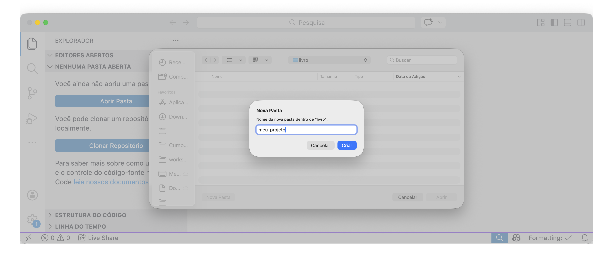<figcaption>
Nomeando a pasta do projeto
</figcaption></figure>



### 6. Selecionar a pasta e clicar em “Abrir”

Selecione `meu-projeto` e clique em **Abrir**.

<figure>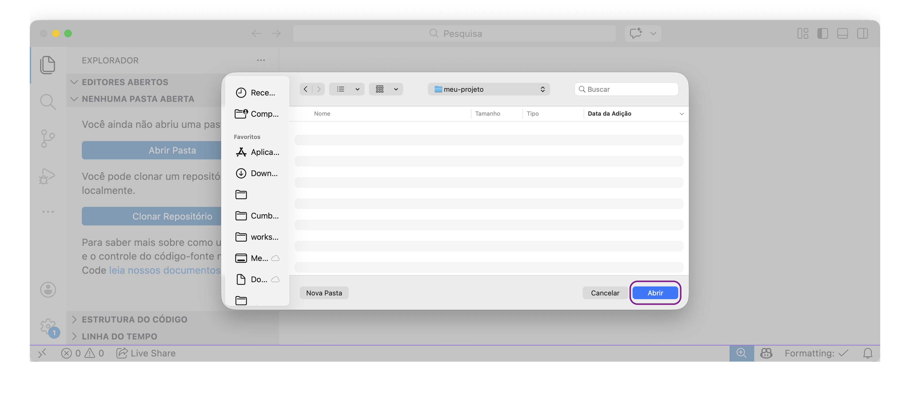<figcaption>
Abrindo a pasta do projeto
</figcaption></figure>

O Explorer passa a mostrar o projeto:

<figure>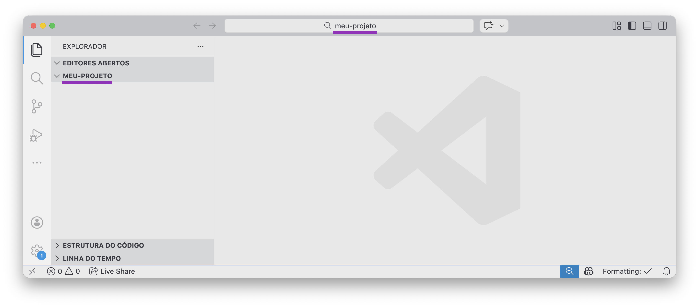<figcaption>
Pasta aberta como projeto
</figcaption></figure>



### 7. Criar um novo arquivo

No Explorer, clique com o botão direito e escolha **Novo arquivo...**.

<figure>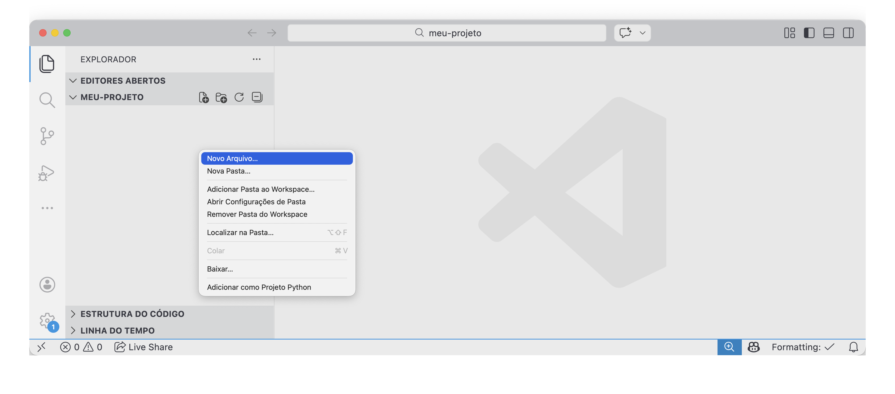<figcaption>
Criando um novo arquivo
</figcaption></figure>



### 8. Dar um nome para o arquivo

Digite o nome, neste caso `meu-arquivo.txt`, e pressione **Enter**.

<figure>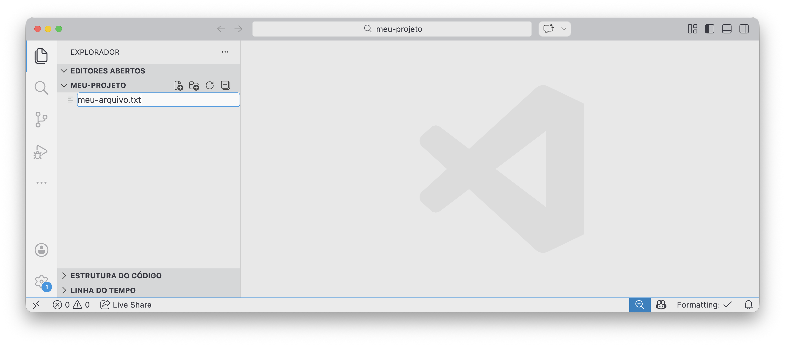<figcaption>
Nomeando o arquivo
</figcaption></figure>

Depois de criado, ele aparece no Explorer:

<figure>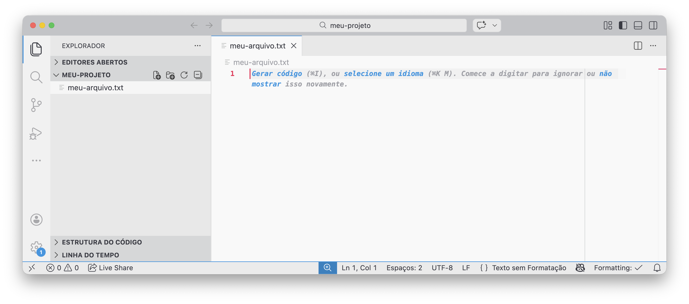<figcaption>
Arquivo criado
</figcaption></figure>



### 9. Escrever e salvar

Clique no arquivo, escreva qualquer texto e salve.

<figure>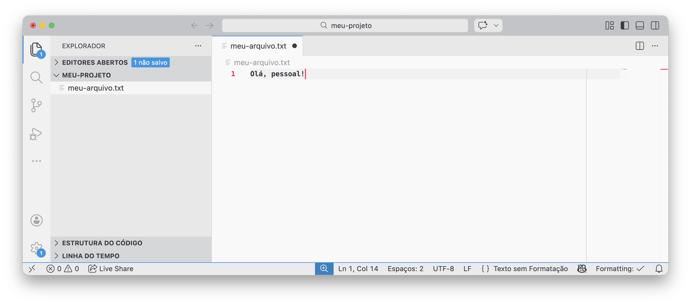<figcaption>
Editando o arquivo
</figcaption></figure>

A bolinha ao lado do nome do arquivo indica que **ainda não está salvo**:

<figure>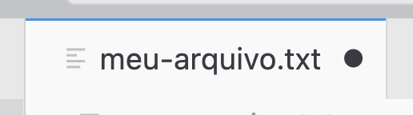<figcaption>
Arquivo com alterações não salvas
</figcaption></figure>

Para salvar:

* Menu **Arquivo** → **Salvar**
* Windows/Linux: `Ctrl + S`
* macOS: `Command + S`

Quando salva, a bolinha para a ser um **X**:

<figure>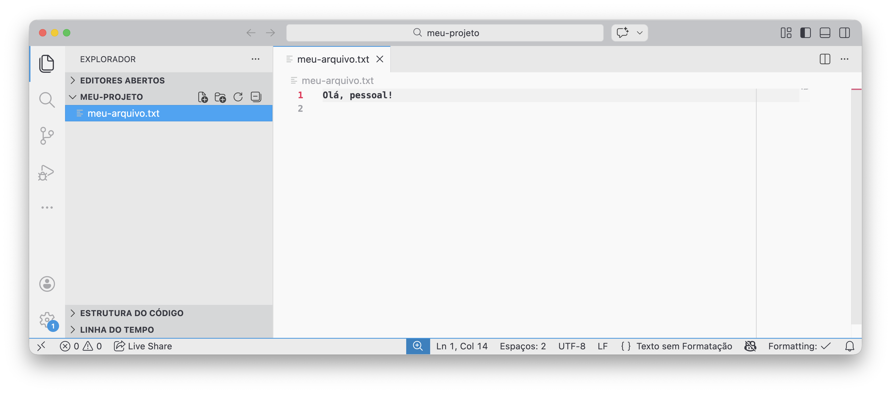<figcaption>
Arquivo salvo
</figcaption></figure>



### 10. Renomear

Clique com o botão direito e selecione **Renomear**.

<figure>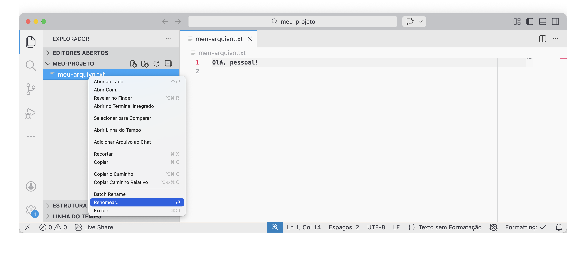<figcaption>
Renomear pelo menu
</figcaption></figure>

Digite o novo nome, neste caso `meu-arquivo-novo.txt`, e pressione **Enter**.

<figure>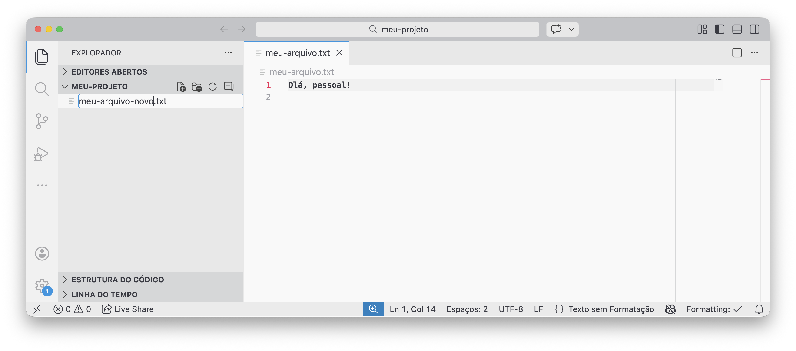<figcaption>
Digitando o novo nome
</figcaption></figure>

Resultado:

<figure>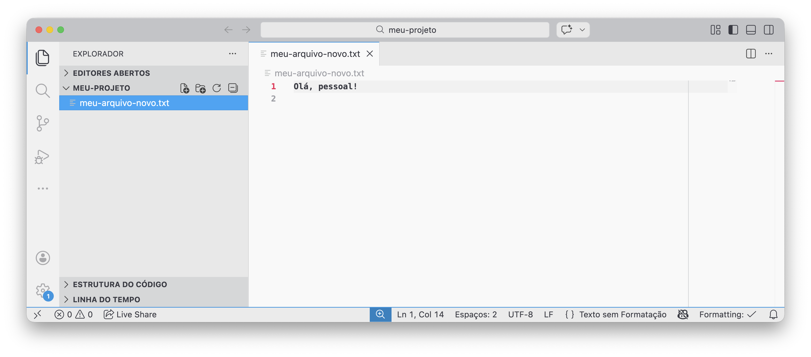<figcaption>
Arquivo renomeado
</figcaption></figure>



### 11. Excluir

Clique com o botão direito e selecione **Excluir**.

<figure>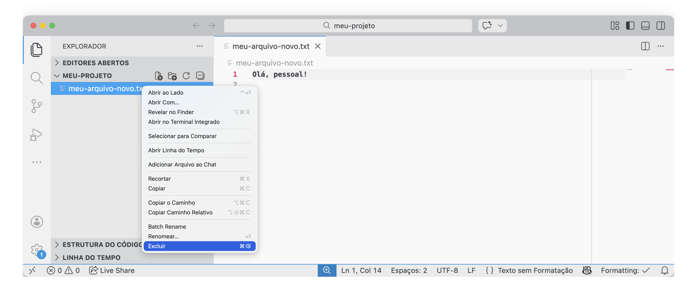<figcaption>
Excluindo um arquivo
</figcaption></figure>

Resultado:

<figure>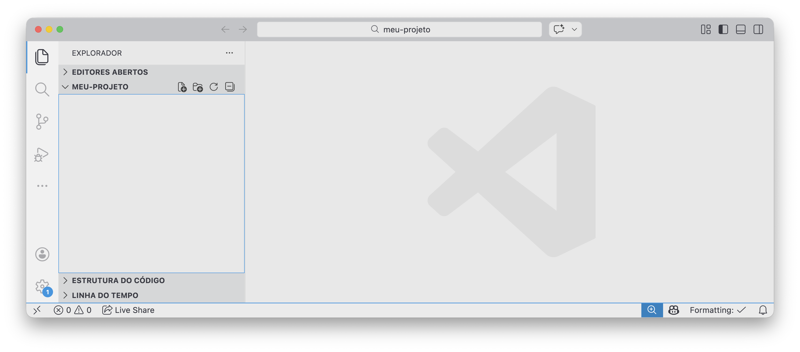<figcaption>
Arquivo removido do projeto
</figcaption></figure>


Em alguns sistemas, excluir pode ir para a lixeira. Em outros, pode remover direto.




***

Você agora domina as interações fundamentais necessárias para trabalhar com um projeto no Visual Studio Code. Ao longo desta seção, foi possível abrir uma pasta, criar arquivos, editar conteúdos, salvar alterações, além de renomear e excluir elementos.

Com isso, concluímos o conjunto de ações necessárias para compreender a primeira etapa do processo de salvar no Git: a manipulação de arquivos.

<figure><figcaption></figcaption></figure>

Na próxima seção, avançaremos para o passo seguinte, explorando como as mudanças realizadas nos arquivos são selecionadas e preparadas na **Staging Area**.
