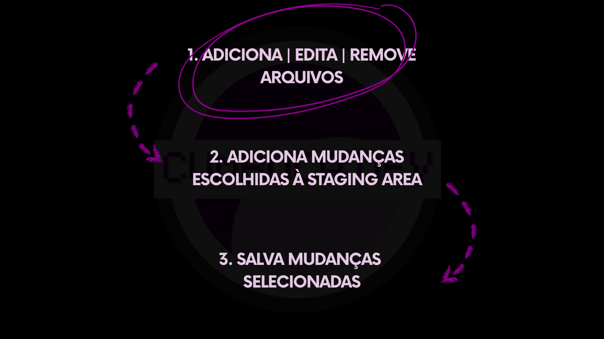

# 6.2 Manipulação de arquivos

Agora começaremos a aprofundar cada etapa do processo de salvar no Git. A primeira delas envolve algo bastante familiar: a manipulação de arquivos.

<figure><figcaption></figcaption></figure>

Manipular arquivos significa realizar as ações básicas dentro de um projeto. Criar novos arquivos, editar conteúdos existentes ou remover elementos que não são mais necessários fazem parte do fluxo natural de trabalho. É nesse momento que as mudanças surgem.

Toda alteração acontece inicialmente no **Working Directory**, o espaço que representa o estado atual do projeto na sua máquina. O Git observa esse ambiente constantemente, detectando quando algo é modificado. Do seu ponto de vista, não importa se você escreveu uma nova linha, alterou um trecho existente ou removeu um arquivo inteiro. Todas essas ações são interpretadas como mudanças no estado do projeto.

É importante compreender que, nesse estágio, o Git ainda não está registrando nada. Ele apenas reconhece que existem diferenças entre o estado atual dos arquivos e o último estado preservado. Podemos pensar nesse momento como a fase mais dinâmica do trabalho, em que experimentamos, ajustamos, testamos e refinamos ideias. As alterações existem, mas ainda não fazem parte da história do projeto.

Somente nas próximas etapas essas mudanças serão organizadas e, eventualmente, preservadas. Antes de avançarmos, é fundamental internalizar essa ideia: **toda mudança nasce a partir da manipulação de arquivos no Working Directory**.

***

Na prática, as alterações são realizadas por meio de ferramentas de edição, e entre elas o editor de código ocupa um papel central no fluxo de trabalho. Na próxima seção, exploraremos esse ambiente e sua importância no dia a dia do desenvolvimento.
