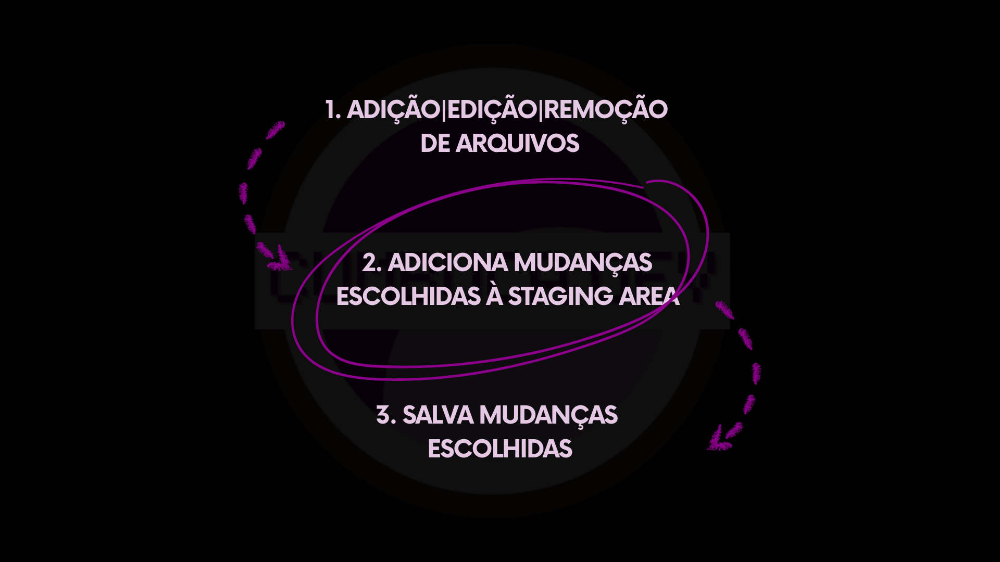

# 6.3 Adicionando arquivos à Staging Area

Após manipular os arquivos do projeto, chegamos ao segundo passo do processo de salvar alterações no Git: Adicionar arquivos à **Staging Area**.

<figure><figcaption></figcaption></figure>

Até aqui, as mudanças realizadas existem apenas no **Working Directory**. Elas refletem o estado atual do trabalho, mas ainda não foram organizadas nem preparadas para se tornarem parte da história do projeto. É nesse ponto que entra a **Staging Area**.

A **Staging Area** funciona como uma etapa intermediária entre o trabalho realizado nos arquivos e o registro definitivo das alterações. Em vez de enviar diretamente todas as mudanças para o repositório, o Git introduz um espaço de preparação.

Esse espaço permite revisar, organizar e selecionar quais alterações devem compor o próximo estado preservado do projeto. Em termos conceituais, a staging area pode ser entendida como uma área de intenção. É nela que você define quais mudanças representam, de fato, uma versão que merece ser registrada. É importante observar que essa etapa não altera o repositório de maneira significativa. Nenhuma nova versão é criada nesse momento. O que ocorre é apenas a preparação das mudanças.

***

Nas próximaa seção, exploraremos como essa preparação acontece na prática.
