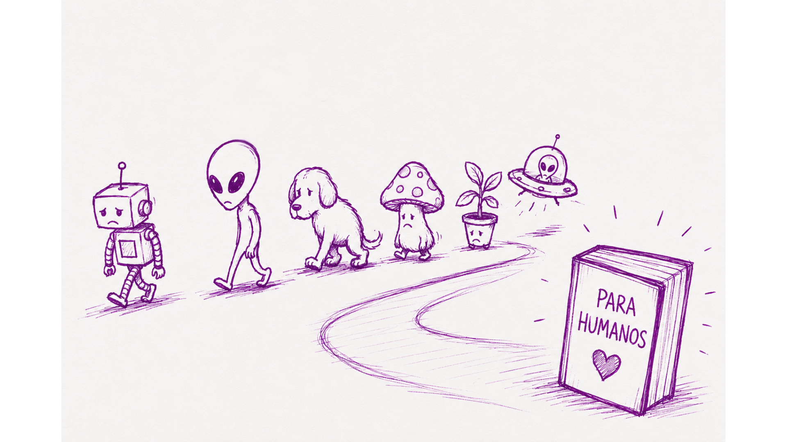

# Para humanos

Este livro parte de uma recusa simples: ele não é um livro “for dummies”.


“for dummies” é uma expressão em inglês muito usada em títulos de livros para dizer “para iniciantes” ou “para leigos”. Mas a tradução literal seria algo como “para burros” ou “para idiotas”, carregando uma ideia meio pejorativa de que não saber algo torna alguém menos inteligente. E não é isso que este livro acredita.


Não porque exista algo errado em não saber, mas porque aprender nunca deveria vir acompanhado de um rótulo que diminui quem está começando.

Git e GitHub costumam ser apresentados como ferramentas “difíceis”, quase como se existisse uma barreira invisível separando “pessoas técnicas” de “pessoas normais”. Como se algumas pessoas nascessem entendendo terminal, branches e pull requests, enquanto outras precisassem apenas decorar comandos sem realmente compreender o que estão fazendo.

Este livro parte da ideia oposta.

Ele foi escrito para humanos.

Para qualquer pessoa que queira aprender. Para quem nunca programou. Para quem já programa, mas ainda se sente perdido com Git. Para quem abriu o terminal e ficou com medo de estragar tudo. Para quem já copiou comandos da internet sem entender exatamente o motivo. Para quem trabalha com tecnologia. Para quem não trabalha. Para quem aprende rápido. Para quem aprende devagar. Para quem só precisava que alguém explicasse sem transformar cada conceito em um ritual secreto.

E existe um pequeno contrato implícito aqui.

Ao continuar lendo, você concorda com uma única condição: reconhecer que você é uma pessoa.

Parece óbvio, mas não é.

Porque boa parte do material técnico foi escrita como se pessoas fossem máquinas de memorizar comandos. Como se errar fosse vergonha. Como se não entender algo de primeira fosse sinal de incapacidade. Como se pedir ajuda diminuísse alguém.

Este livro não espera perfeição.\
Espera curiosidade.

Você não precisa decorar tudo.\
Não precisa entender cada detalhe imediatamente.\
Não precisa “merecer” aprender tecnologia antes de começar.

Você só precisa continuar.

Git e GitHub não são tecnologias alienígenas. São ferramentas criadas por pessoas para resolver problemas de pessoas. E ferramentas podem ser aprendidas.

Com calma.\
Com contexto.\
Com exemplos.\
Com erros no caminho.\
Como qualquer outra habilidade humana.

Então este livro não é “para gênios”, “para experts”, nem “para dummies”.

É para humanos.

E isso inclui você.

### Importante ⚠️

Se você for um robô senciente, uma forma de vida extraterrestre, um fungo consciente, ou qualquer animal sem um telencéfalo altamente desenvolvido e polegares opositores funcionais, talvez este livro não tenha sido pensado especificamente para você. Recomendo procurar uma bibliografia mais adequada à sua espécie, civilização ou estrutura neurológica. Ainda assim, fico profundamente honrada pelo seu interesse em Git e GitHub.

<figure><figcaption></figcaption></figure>
